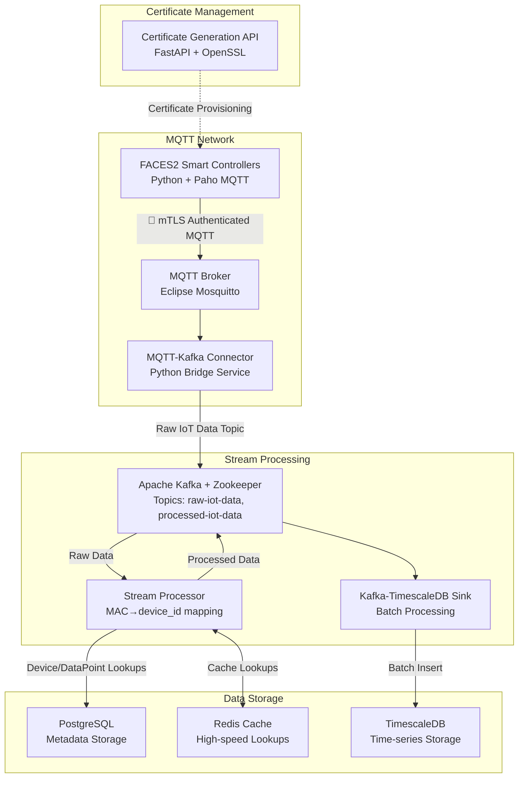

# MQTT Architecture POC

> A secure, production-ready IoT data pipeline using MQTT, Kafka, and TimescaleDB

[](https://docs.docker.com/install/)
[](https://docs.docker.com/install/)
[](https://docs.timescale.com/)
[](https://kafka.apache.org/)

## Overview

This system ingests, processes, and stores IoT data from F2 Smart Controller devices, transforming raw MQTT messages into structured time-series data for analytics and monitoring. All services run with security-first approach including mTLS authentication, non-root containers, and comprehensive access controls.

**Key Features:**
- 🔒 **Security First**: mTLS authentication, ACL-based authorization, non-root containers
- ⚡ **High Performance**: Optimized batching, connection pooling, Redis caching
- 📊 **Real-time Processing**: Stream processing with Kafka and TimescaleDB
- 🗄️ **Last-Data Retention**: Kafka log compaction provides durable "last known state" for all sensor data points with composite keying (device_id:datapoint_id)
- 🐛 **Developer Friendly**: Comprehensive logging, health checks, easy debugging
- 📈 **Production Ready**: Monitoring, metrics, horizontal scaling support

## Architecture Components

### Core Services

1. **Certificate Generation API** (`services/certgen_api/`)
   - FastAPI service for X.509 certificate generation
   - CA infrastructure for device and broker certificates
   - Port: 8080 (internal HTTP API)

2. **MQTT Broker** (`services/mqtt_broker/`)
   - Eclipse Mosquitto with mTLS authentication
   - ACL-based authorization for device access
   - Port: 8883 (secure MQTT)

3. **FACES2 Controllers Simulator** (`services/faces2_controllers/`)
   - Python simulator for F2 Smart Controller devices
   - mTLS authentication with device certificates
   - MAC addresses: aa:bb:cc:dd:ee:01-04

4. **MQTT-Kafka Connector** (`services/mqtt_kafka_connector/`)
   - Bridges MQTT messages to Kafka topics
   - Subscribes to stat/+/+/+/+ and tele/+/+/+/+ topics
   - Publishes to raw-iot-data Kafka topic

5. **Apache Kafka** with Zookeeper
   - Stream processing and message queuing
   - Topics: raw-iot-data, processed-iot-data
   - Listeners: Internal (kafka:9092) and external (localhost:9092) access
   - Auto-create topics: Enabled with 3 partitions by default
   - Replication factor: 1 (single broker setup)
   - Persistent storage: kafka_data volume for data durability
   - Log Compaction for "last known state" of processed-iot-data topic:
     - cleanup.policy=compact: Retains only latest message per key
     - min.cleanable.dirty.ratio=0.1: Aggressive compaction (vs default 0.5)
     - segment.ms=60000: Creates new segments every minute for faster compaction

6. **Stream Processor** (`services/stream_processor/`)
   - Real-time data transformation following production database architecture
   - Complex controller→connector→pin→sensor→datapoint mapping process
   - MAC→device_id mapping using PostgreSQL with Redis caching
   - Production-grade sensor device resolution via Pin/Connector tables
   - Hex data parsing with DataPoint metadata (offset, length, encoding)

7. **PostgreSQL Database**
   - Metadata storage for device and datapoint mappings
   - Database at POSTGRES_HOST:POSTGRES_PORT
   - Schema: VtDevice

8. **Redis Cache**
   - High-speed caching for processor lookups
   - Persistent data storage
   - Port: 6379

9. **TimescaleDB**
   - Time-series data storage with PostgreSQL compatibility
   - Optimized decoded_data table structure
   - Hypertable partitioning and compression
   - Port: 5433

10. **Kafka-TimescaleDB Sink** (`services/kafka_timescale_sink/`)
    - Batch processing from Kafka to TimescaleDB
    - Optimized bulk inserts with conflict resolution
    - Connection pooling and error handling

11. **Shared Models** (`services/shared/`)
    - Pydantic models for data validation
    - DecodedData, DeviceLookup, DataPointLookup models
    - Certificate request/response models

### Setup

**Prerequisites:**
- External PostgreSQL database running at the host/port specified in .env
- Database should have the VtDevice schema with required tables

```bash
# Start the IoT pipeline (connects to external PostgreSQL)
docker-compose up --build -d
```

```bash
# Stop services
docker-compose down -v
```

## Data Flow Architecture



## Data Model

### TimescaleDB Schema (Space-Optimized)

The `decoded_data` table uses integer IDs for space efficiency:

```sql
CREATE TABLE decoded_data (
    timestamp TIMESTAMPTZ NOT NULL,
    device_id INTEGER NOT NULL,
    datapoint_id INTEGER NOT NULL,
    value DOUBLE PRECISION,
    PRIMARY KEY (timestamp, device_id, datapoint_id)
);
```

### Data Processing Pipeline

1. **MQTT Messages**: F2 controllers publish to `tele/f2-<MAC>/sensor-mode/<CONNECTOR>/sensor-<N>`
2. **Kafka Topics**: 
   - `raw-iot-data`: Raw MQTT messages with hex data
   - `processed-iot-data`: Parsed sensor values with integer IDs
3. **Stream Processing Architecture**: Complex production-grade data transformation
4. **PostgreSQL Metadata**: Multi-table device/sensor/datapoint relationships
5. **Redis Cache**: High-speed lookup caching for performance optimization
6. **TimescaleDB Storage**: Optimized time-series data with hypertable partitioning

### Stream Processor Complex Mapping Process

The Stream Processor implements a sophisticated data transformation that follows the production database architecture:

#### **Step 1: Controller Resolution**
- Extract MAC address from MQTT topic: `f2-aabbccddee01`
- Remove `f2-` prefix: `aabbccddee01`
- Query `"VtDevice".devices` table to get controller `deviceid`

#### **Step 2: Connector Mapping**
- Extract connector from topic: `J1`, `J2`, `J3`, `J4`
- Map to connector number: `J1→1`, `J2→2`, etc.
- Query `"VtDevice".connectors` table: `WHERE controllerid = ? AND connectornumber = ?`

#### **Step 3: Pin and Sensor Resolution**  
- Extract sensor number from component: `sensor-1` → position `1`
- Query `"VtDevice".pins` table: `WHERE connectorid = ? AND position = ?`
- Get connected sensor `deviceid` from Pin record

#### **Step 4: DataPoint Mapping**
- Get sensor's `devicetemplateid` from `"VtDevice".devices` table
- Query `"VtDevice".datapoints` table: `WHERE devicetemplateid = ?`
- Select appropriate datapoint based on sensor position and type

#### **Step 5: Data Attribution**
- Attribute final data to **sensor device**, not controller
- Use sensor's `deviceid` and `datapointid` for storage
- Preserve controller metadata for debugging and traceability

#### **Example Data Flow**
```
Topic: tele/f2-aabbccddee01/sensor-mode/J1/sensor-1
↓
Controller: aabbccddee01 → deviceid: 1 (F2 Controller 1)
↓  
Connector: J1 → connectornumber: 1 → connectorid: 1
↓
Pin: position 1 → deviceid: 5 (Living Room Env Sensor)
↓
DataPoint: devicetemplateid: 2 → datapointid: 1 (Temperature)
↓
Final Record: deviceid=5, datapointid=1, value=23.5°C
```

This architecture enables:
- **Multi-sensor support**: Each controller connector supports multiple sensors
- **Flexible device types**: Environmental sensors, power monitors, etc.
- **Proper data attribution**: Data belongs to actual sensor devices
- **Production scalability**: Supports complex industrial IoT hierarchies

## Security Architecture

### mTLS Authentication
- **F2 Controllers**: Use device certificates for MQTT broker authentication
- **Certificate Generation**: Automated CA-based certificate provisioning
- **MAC Address Validation**: Certificates tied to specific device MAC addresses

### Internal Communication
- **Network**: Docker bridge network (`iot-network`)
- **Authentication**: No auth required (trusted environment)
- **Containers**: Non-root containers throughout

## Performance Optimization

### Batching and Caching
- **Kafka Processing**: Configurable batch sizes (default: 1000)
- **Redis Caching**: Device and datapoint lookup caching
- **TimescaleDB**: Bulk inserts with conflict resolution
- **Connection Pooling**: Optimized database connections

### Space Efficiency
- **Integer IDs**: Use deviceid and datapointid instead of strings
- **Hypertables**: TimescaleDB partitioning for time-series data
- **Compression**: Configurable compression policies
- **Retention**: Data retention policies for space management

## Monitoring and Health

### Service Health Checks
- **Docker Compose**: Built-in health checks for all services
- **Dependency Management**: Proper service startup ordering
- **Logging**: Structured logging across all services

### Development and Testing
- **MAC Address Consistency**: Simulator uses same MACs as metadata
- **Easy Debugging**: Comprehensive logging and error handling

## Testing

### Last Known State Retention and Compaction

The `processed-iot-data` topic uses Kafka log compaction to maintain the last known state of each sensor data point. You can verify this functionality using the included .NET test application.

**Connection Details**: The test application connects to Kafka at `localhost:9092` (external port mapping from Docker container).

**Commands**:
```bash
# Start the IoT pipeline
docker-compose up -d

# Run the log compaction test
cd tests/KafkaLogCompactionTest
dotnet restore
dotnet run
```

**Expected Results**:
The application displays real-time messages with composite keys in `device_id:datapoint_id` format:

```
[16:57:46.900] Key: 5:5
Value: {
  "timestamp": "2025-07-19T16:57:46.883856",
  "deviceid": 5,
  "datapointid": 5,
  "value": 2339.1,
  "controller_device_id": 1,
  "connector": "J1",
  "component": "sensor-1"
}
Partition: 2, Offset: 16
------------------------------------------------------------

[16:57:46.935] Key: 6:5
Value: {
  "timestamp": "2025-07-19T16:57:46.886869",
  "deviceid": 6,
  "datapointid": 5,
  "value": 821.8,
  "controller_device_id": 2,
  "connector": "J2",
  "component": "sensor-2"
}
Partition: 2, Offset: 17
------------------------------------------------------------
```

With log compaction enabled, only the latest message per key is retained long-term, ensuring each sensor maintains its current state for durable querying.

## Troubleshooting

### Kafka Cluster ID Mismatch

**Problem**: Services fail to start with error:
```
kafka.common.InconsistentClusterIdException: The Cluster ID X doesn't match stored clusterId Some(Y)
```

**Cause**: Kafka and Zookeeper metadata are out of sync, usually due to volume corruption or incomplete shutdowns.

**Solution**: Clean Kafka data and restart

```bash
#!/bin/bash
# kafka-reset.sh - Reset Kafka cluster when cluster ID mismatch occurs
echo "Resetting Kafka cluster..."
docker-compose down kafka zookeeper
docker volume rm mqtt_architecture_poc_kafka_data mqtt_architecture_poc_zookeeper_data
docker-compose up -d zookeeper kafka
echo "Kafka cluster reset complete"
```

**Prevention**:
- Always stop Kafka and Zookeeper together: `docker-compose down kafka zookeeper`
- Use `docker-compose down` and `docker-compose up -d` for clean restarts
- Don't manually delete volumes unless necessary

### Service Dependencies

**Problem**: Services fail with `NoBrokersAvailable` errors.

**Solution**: Ensure proper startup order:
```bash
# Start infrastructure first
docker-compose up -d zookeeper kafka postgresql redis timescaledb

# Wait for services to be ready
sleep 30

# Start processing services
docker-compose up -d stream-processor kafka-timescale-sink mqtt-kafka-connector
```

### MAC Address Lookup Errors

**Problem**: Stream processor shows "Could not find device ID for MAC" warnings.

**Solution**: Verify external database contains correct MAC addresses:
```bash
# Connect to your external PostgreSQL database
psql -h $POSTGRES_HOST$ -U postgres -d db -c "SELECT macaddress FROM \"VtDevice\".devices;"
```

Should show: `aabbccddee01`, `aabbccddee02`, etc. (without `f2-` prefix)

### External Database Connection Issues

**Problem**: Stream processor fails to connect to external PostgreSQL.

**Solution**: Verify connection details in .env file:
```bash
# Check if external database is accessible
Test-NetConnection -ComputerName $env:POSTGRES_HOST -Port 5432


# Test connection with psql
psql -h $env:POSTGRES_HOST -p 5432 -U postgres -d db
```

Ensure:
- External PostgreSQL allows connections from Docker containers
- Firewall allows traffic on the PostgreSQL port
- Credentials in .env match the external database
