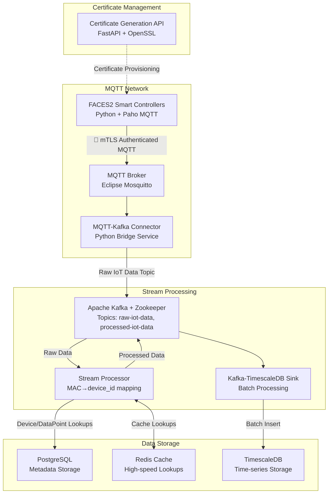

# MQTT Architecture POC

> A secure, production-ready IoT data pipeline using MQTT, Kafka, and TimescaleDB

[](https://docs.docker.com/install/)
[](https://docs.docker.com/install/)
[](https://docs.timescale.com/)
[](https://kafka.apache.org/)

## Overview

This system ingests, processes, and stores IoT data from F2 Smart Controller devices, transforming raw MQTT messages into structured time-series data for analytics and monitoring. All services run with security-first approach including mTLS authentication, non-root containers, and comprehensive access controls.

**Key Features:**
- 🔒 **Security First**: mTLS authentication, ACL-based authorization, non-root containers
- ⚡ **High Performance**: Optimized batching, connection pooling, Redis caching
- 📊 **Real-time Processing**: Stream processing with Kafka and TimescaleDB
- 🐛 **Developer Friendly**: Comprehensive logging, health checks, easy debugging
- 📈 **Production Ready**: Monitoring, metrics, horizontal scaling support

## Architecture Components

### Core Services

1. **Certificate Generation API** (`services/certgen_api/`)
   - FastAPI service for X.509 certificate generation
   - CA infrastructure for device and broker certificates
   - Port: 8080 (internal HTTP API)

2. **MQTT Broker** (`services/mqtt_broker/`)
   - Eclipse Mosquitto with mTLS authentication
   - ACL-based authorization for device access
   - Port: 8883 (secure MQTT)

3. **FACES2 Controllers Simulator** (`services/faces2_controllers/`)
   - Python simulator for F2 Smart Controller devices
   - mTLS authentication with device certificates
   - MAC addresses: aa:bb:cc:dd:ee:01-04

4. **MQTT-Kafka Connector** (`services/mqtt_kafka_connector/`)
   - Bridges MQTT messages to Kafka topics
   - Subscribes to stat/+/+/+/+ and tele/+/+/+/+ topics
   - Publishes to raw-iot-data Kafka topic

5. **Apache Kafka** with Zookeeper
   - Stream processing and message queuing
   - Topics: raw-iot-data, processed-iot-data
   - Port: 9092 (internal Kafka protocol)

6. **Stream Processor** (`services/stream_processor/`)
   - Real-time data transformation
   - MAC→device_id mapping using PostgreSQL
   - Redis caching for performance
   - Hex data parsing and sensor value extraction

7. **PostgreSQL Database**
   - Metadata storage for device and datapoint mappings
   - Uses sql/init.sql for schema initialization
   - Port: 5432

8. **Redis Cache**
   - High-speed caching for processor lookups
   - Persistent data storage
   - Port: 6379

9. **TimescaleDB**
   - Time-series data storage with PostgreSQL compatibility
   - Optimized decoded_data table structure
   - Hypertable partitioning and compression
   - Port: 5433

10. **Kafka-TimescaleDB Sink** (`services/kafka_timescale_sink/`)
    - Batch processing from Kafka to TimescaleDB
    - Optimized bulk inserts with conflict resolution
    - Connection pooling and error handling

11. **Shared Models** (`services/shared/`)
    - Pydantic models for data validation
    - DecodedData, DeviceLookup, DataPointLookup models
    - Certificate request/response models

### Setup
```bash
docker-compose up -d
```

## Data Flow Architecture



## Data Model

### TimescaleDB Schema (Space-Optimized)

The `decoded_data` table uses integer IDs for space efficiency:

```sql
CREATE TABLE decoded_data (
    timestamp TIMESTAMPTZ NOT NULL,
    device_id INTEGER NOT NULL,
    datapoint_id INTEGER NOT NULL,
    value DOUBLE PRECISION,
    PRIMARY KEY (timestamp, device_id, datapoint_id)
);
```

### Data Processing Pipeline

1. **MQTT Messages**: F2 controllers publish to `stat/f2-<MAC>/sensor-mode/*/sensor-*`
2. **Kafka Topics**: 
   - `raw-iot-data`: Raw MQTT messages with hex data
   - `processed-iot-data`: Parsed sensor values with integer IDs
3. **PostgreSQL Metadata**: MAC→device_id and sensor_label→datapoint_id mappings
4. **Redis Cache**: High-speed lookup caching for performance
5. **TimescaleDB Storage**: Optimized time-series data with hypertable partitioning

## Security Architecture

### mTLS Authentication
- **F2 Controllers**: Use device certificates for MQTT broker authentication
- **Certificate Generation**: Automated CA-based certificate provisioning
- **MAC Address Validation**: Certificates tied to specific device MAC addresses

### Internal Communication
- **Network**: Docker bridge network (`iot-network`)
- **Authentication**: No auth required (trusted environment)
- **Containers**: Non-root containers throughout

## Performance Optimization

### Batching and Caching
- **Kafka Processing**: Configurable batch sizes (default: 1000)
- **Redis Caching**: Device and datapoint lookup caching
- **TimescaleDB**: Bulk inserts with conflict resolution
- **Connection Pooling**: Optimized database connections

### Space Efficiency
- **Integer IDs**: Use device_id and datapoint_id instead of strings
- **Hypertables**: TimescaleDB partitioning for time-series data
- **Compression**: Configurable compression policies
- **Retention**: Data retention policies for space management

## Monitoring and Health

### Service Health Checks
- **Docker Compose**: Built-in health checks for all services
- **Dependency Management**: Proper service startup ordering
- **Logging**: Structured logging across all services

### Development and Testing
- **Test Pipeline**: End-to-end testing script (`test_pipeline.py`)
- **MAC Address Consistency**: Simulator uses same MACs as metadata
- **Easy Debugging**: Comprehensive logging and error handling
