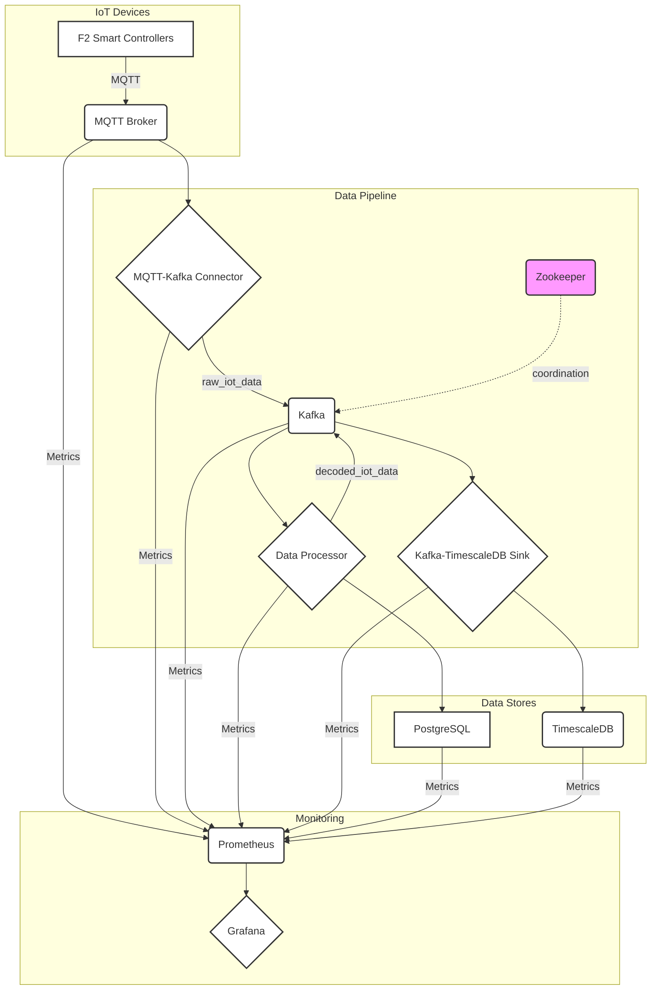

# MQTT Architecture POC

This project is a proof-of-concept for a production-ready IoT data pipeline using MQTT, Kafka, and TimescaleDB.

## Architecture Overview

The system is designed to ingest, process, and store data from F2 Smart Controller IoT devices. It transforms raw, device-specific MQTT messages into meaningful, decoded data, optimized for time-series analysis.



## Containers

-   **F2 Device Simulator**: Simulates IoT devices publishing MQTT messages.
-   **MQTT Broker (Mosquitto)**: Central message hub for device communications.
-   **MQTT-Kafka Connector**: Bridges MQTT messages to Kafka topics.
-   **Zookeeper**: Coordination service for Kafka cluster management.
-   **Apache Kafka**: Message streaming platform with raw and processed data topics.
-   **PostgreSQL**: Stores device parameters and metadata.
-   **Data Processor**: Transforms raw data into meaningful measurements.
-   **TimescaleDB**: Time-series database for analytics and storage.
-   **Kafka-TimescaleDB Sink**: Persists processed data to TimescaleDB.
-   **Prometheus**: Metrics collection and storage.
-   **Grafana**: Visualization dashboards.
-   **cAdvisor**: Container resource monitoring.
-   **Node Exporter**: Host system metrics.
-   **Health Monitor**: Custom health check API.

## Shared Models

The `shared/` directory contains reusable Pydantic models used across multiple services to ensure data consistency throughout the pipeline:

-   **IotMeasurement**: Standardized schema for IoT sensor data with built-in validation and type conversion
    - Handles timestamp conversion from various formats
    - Extracts numeric values from strings with units (e.g., "27.93 °C" → 27.93)
    - Maps field aliases for compatibility with different services
    - Ensures database schema compliance

Services using shared models:
-   **Data Processor**: Validates outgoing Kafka messages
-   **Kafka-TimescaleDB Sink**: Validates incoming data before database insertion

For detailed information, see [shared/README.md](./shared/README.md).

## How to Run

### Prerequisites

-   Docker
-   Docker Compose

### 1. Start the services

```bash
docker-compose up -d
```

### 2. Start the monitoring stack

```bash
docker-compose -f monitoring/docker-compose.monitoring.yml up -d
```

### 3. Check the status

```bash
docker-compose ps
docker-compose -f monitoring/docker-compose.monitoring.yml ps
```

## Documentation

-   **Architecture**: For a detailed explanation of the system architecture, see [docs/architecture/overview.md](./docs/architecture/overview.md).
-   **Monitoring**: For more information on the monitoring stack, see [docs/monitoring/overview.md](./docs/monitoring/overview.md).
-   **MQTT Topics**: For details on the MQTT topic structure, see [docs/architecture/mqtt_topics.md](./docs/architecture/mqtt_topics.md).
-   **Data Models**: For details on the data models, see [docs/architecture/data-models.md](./docs/architecture/data-models.md).

## Stopping the System

### 1. Stop the services

```bash
docker-compose down
```

### 2. Stop the monitoring stack

```bash
docker-compose -f monitoring/docker-compose.monitoring.yml down
```