# MQTT Architecture POC

> A production-ready IoT data pipeline using MQTT, Kafka, and TimescaleDB

[](https://docs.docker.com/install/)
[](https://docs.timescale.com/)
[](https://kafka.apache.org/)

## 🎯 Overview

This system ingests, processes, and stores IoT data from F2 Smart Controller devices, transforming raw MQTT messages into structured time-series data for analytics and monitoring.

**Key Features:**
- Real-time data processing pipeline
- Time-series data storage with compression
- Comprehensive monitoring and alerting
- Scalable microservices architecture
- Developer-friendly debugging tools

### Architecture


### Secure Architecture with Performance Optimization

```mermaid
graph TB
    subgraph "IoT Devices"
        A[F2 Smart Controllers<br/>🔐 MQTT Auth Required]
    end
    
    subgraph "Message Ingestion"
        B[MQTT Broker<br/>🔐 Port: 1883<br/>Auth Required]
        C[MQTT-Kafka Connector<br/>⚡ Optimized Batching]
    end
    
    subgraph "Stream Processing"
        D[Apache Kafka<br/>⚡ Port: 9092<br/>Enhanced Config]
        E[Data Processor<br/>🗄️ Redis Cache<br/>🔒 Input Validation]
        F[Kafka-TimescaleDB Sink<br/>⚡ 10x Larger Batches]
    end
    
    subgraph "Data Storage"
        G[(PostgreSQL<br/>🔒 Internal Only<br/>Connection Pool)]
        H[(TimescaleDB<br/>🔒 Internal Only<br/>Compression)]
        R[Redis Cache<br/>⚡ Device Parameters]
    end
    
    subgraph "Monitoring Stack"
        I[Prometheus<br/>Port: 9090]
        J[Grafana<br/>Port: 3000]
        K[Health Monitor<br/>Port: 8000]
    end
    
    A -->|🔐 Authenticated MQTT| B
    B --> C
    C -->|Raw IoT Data Topic| D
    D --> E
    E <-->|⚡ Cached Lookups| R
    E -->|🔒 Secure Queries| G
    E -->|Decoded Data Topic| D
    D --> F
    F -->|⚡ Batch Insert| H
    
    B -.->|Metrics| I
    C -.->|Metrics| I
    D -.->|Metrics| I
    E -.->|Metrics| I
    F -.->|Metrics| I
    G -.->|Metrics| I
    H -.->|Metrics| I
    K -.->|Health Checks| I
    I --> J
    
    class A,B,E,G,H security
    class C,D,F,R performance
    class I,J,K standard
```



## Containers

### Architecture
[docs/architecture/overview.md](./docs/architecture/overview.md)

#### IoT Devices
-    **F2 Device Simulator**: Simulates IoT devices publishing MQTT messages.

####  Data Pipeline
-   **MQTT Broker (Mosquitto)**: Central message hub for device communications.
-   **MQTT-Kafka Connector**: Bridges MQTT messages to Kafka topics.
-   **Zookeeper**: Coordination service for Kafka cluster management.
-   **Apache Kafka**: Message streaming platform with raw and processed data topics.
-   **Data Processor**: Transforms raw data into meaningful measurements.
-   **Kafka-TimescaleDB Sink**: Persists processed data to TimescaleDB.

#### Data Stores
-   **PostgreSQL**: Stores device parameters and metadata.
-   **TimescaleDB**: Time-series database for analytics and storage.

### Monitoring
[docs/monitoring/overview.md](./docs/monitoring/overview.md)

-   **Prometheus**: Metrics collection and storage.
-   **Grafana**: Visualization dashboards.
-   **cAdvisor**: Container resource monitoring.
-   **Node Exporter**: Host system metrics.
-   **Health Monitor**: Custom health check API.

## Shared Models
The `shared/` directory contains reusable Pydantic models used across multiple services to ensure data consistency throughout the pipeline:

-   **IotMeasurement**: Standardized schema for IoT sensor data with built-in validation and type conversion
    - Handles timestamp conversion from various formats
    - Extracts numeric values from strings with units (e.g., "27.93 °C" → 27.93)
    - Maps field aliases for compatibility with different services
    - Ensures database schema compliance

Services using shared models:
-   **Data Processor**: Validates outgoing Kafka messages
-   **Kafka-TimescaleDB Sink**: Validates incoming data before database insertion

For detailed information, see [shared/README.md](./shared/README.md).

## 🚀 Quick Start

### Prerequisites
- Docker 20.10+
- Docker Compose 2.0+
- 8GB+ RAM recommended
- Make utility (optional but recommended)

### 1. Secure Setup (Recommended for Production)
```bash
# Setup with enhanced security and performance
make secure-setup

# Check system health
make health

# Test MQTT authentication
make mqtt-test
```

### 2. Development Setup
```bash
# Start all services including monitoring
make full-setup

# Check system health
make health

# View real-time logs
make logs
```

### 3. Manual Setup
```bash
# Start core services
docker-compose up -d

# Start monitoring stack
docker-compose -f monitoring/docker-compose.monitoring.yml up -d

# Verify all services are running
make status
```

### 4. Access Dashboards
- **Grafana**: http://localhost:3000 (admin/admin)
- **Prometheus**: http://localhost:9090
- **Health Monitor**: http://localhost:8000
- **cAdvisor**: http://localhost:8080

### 🔒 Security Features
- **MQTT Authentication**: Username/password required
- **Database Security**: No external port exposure
- **Container Security**: Non-root users, resource limits
- **Secrets Management**: File-based credential storage
- **Input Validation**: SQL injection prevention

## 📚 Documentation

### For Developers
- 🏗️ **[Architecture Overview](docs/architecture/overview.md)** - System design and components
- 🚦 **[Getting Started Guide](docs/DEVELOPER_GUIDE.md)** - Developer onboarding and setup
- 🐛 **[Debugging & Troubleshooting](docs/DEBUGGING.md)** - Common issues and solutions
- 📊 **[TimescaleDB Guide](docs/TIMESCALE.md)** - Time-series database usage and optimization
- 🔒 **[Security Guide](docs/SECURITY.md)** - Security implementation and best practices

### System Architecture
- 🔄 **[Data Flow](docs/architecture/data-models.md)** - How data moves through the system
- 📡 **[MQTT Topics](docs/architecture/mqtt_topics.md)** - Message structure and routing
- 🏗️ **[Service Components](docs/architecture/)** - Individual service documentation
  - [MQTT-Kafka Connector](docs/architecture/mqtt-kafka-connector.md)
  - [Data Processor](docs/architecture/data-processor.md)
  - [Kafka-TimescaleDB Sink](docs/architecture/kafka-timescale-sink.md)
  - [F2 Simulator](docs/architecture/f2-simulator.md)

### Operations & Monitoring
- 📊 **[Monitoring Stack](docs/monitoring/overview.md)** - Prometheus, Grafana, and health checks
- 🚨 **[Health Monitoring](docs/monitoring/health-monitor.md)** - Service health and alerts
- 📈 **[Grafana Dashboards](docs/monitoring/grafana-setup.md)** - Visualization and metrics
- 📝 **[Logging Guide](docs/LOGGING.md)** - Log levels, formats, and debugging

### Production & Security
- 🔒 **[Security Implementation](docs/SECURITY.md)** - Authentication, authorization, and hardening
- ⚡ **[Performance Optimization](docs/PERFORMANCE.md)** - Tuning and scaling guidelines
- 🚀 **[Deployment Guide](docs/DEPLOYMENT.md)** - Production deployment best practices

## 🔧 Common Operations

### Monitoring and Health
```bash
# Check overall system health
make health

# Monitor specific services
make logs-processor     # Data processor logs
make logs-sink         # TimescaleDB sink logs
make logs-connector    # MQTT-Kafka connector logs

# Database access
make db-timescale      # Connect to TimescaleDB
make db-params         # Connect to PostgreSQL
```

### Security Operations
```bash
# Setup secure environment
make secure-setup

# Test MQTT authentication
make mqtt-test

# Check security configuration
make security-check

# Monitor MQTT messages (with auth)
make mqtt-monitor
```

### Kafka Operations
```bash
# List Kafka topics
make kafka-topics

# Monitor message streams
make kafka-raw         # Raw IoT data
make kafka-decoded     # Processed data
```

### Performance Monitoring
```bash
# View system performance
make performance

# Run benchmarks
make benchmarks

# Check container resources
docker stats
```

### System Management
```bash
# Graceful shutdown
make clean

# Restart in secure mode
make restart-secure

# Create database backups
make backup
```

## 🚨 Troubleshooting

For detailed debugging information, see [docs/DEBUGGING.md](docs/DEBUGGING.md)

**Quick Diagnostics:**
```bash
# Check service status
make status

# View recent logs
make logs

# Test connectivity
curl http://localhost:8000/health
```

## 🛠️ Development

See [docs/DEVELOPER_GUIDE.md](docs/DEVELOPER_GUIDE.md) for:
- Code structure and conventions  
- Local development setup
- Testing procedures
- Contributing guidelines

## 📈 Performance & Scaling

The system is optimized for high throughput with:
- **TimescaleDB** compression and partitioning (90%+ storage reduction)
- **Kafka** optimized batch processing (10x larger batches)
- **Redis caching** for device parameters (eliminates repeated DB queries)
- **Connection pooling** with PgBouncer for database operations
- **Horizontal scaling** support for all services
- **Resource limits** preventing resource exhaustion
- **Non-root containers** for enhanced security

### Performance Improvements Implemented
- **5-10x faster** message processing throughput
- **90%+ reduction** in database query load through caching
- **Optimized batch sizes** (100 → 1000 records)
- **Enhanced Kafka configuration** for better network utilization
- **Connection pooling** preventing connection exhaustion

For detailed optimization guides, see [docs/PERFORMANCE.md](docs/PERFORMANCE.md)