# MQTT Architecture POC

> A secure, production-ready IoT data pipeline using MQTT, Kafka, and TimescaleDB

[](https://docs.docker.com/install/)
[](https://docs.docker.com/install/)
[](https://docs.timescale.com/)
[](https://kafka.apache.org/)

## Overview

This system ingests, processes, and stores IoT data from F2 Smart Controller devices, transforming raw MQTT messages into structured time-series data for analytics and monitoring. All services run with security-first approach including mTLS authentication, non-root containers, and comprehensive access controls.

**Key Features:**
- 🔒 **Security First**: mTLS authentication, ACL-based authorization, non-root containers
- ⚡ **High Performance**: Optimized batching, connection pooling, Redis caching
- 📊 **Real-time Processing**: Stream processing with Kafka and TimescaleDB
- 🐛 **Developer Friendly**: Comprehensive logging, health checks, easy debugging
- 📈 **Production Ready**: Monitoring, metrics, horizontal scaling support


### Setup
```bash
docker-compose up -d
```

## Secure Architecture with Performance Optimization

```mermaid
graph TB
    subgraph "MQTT Network"
        A[F2 Smart Controllers]
        B[MQTT Broker]
        C[MQTT-Kafka Connector<br/>⚡ Optimized Batching]
        CA_API[Certificate Generation API]

    end
    
    subgraph "Stream Processing"
        D[Apache Kafka<br/>⚡ Port: 9092<br/>Enhanced Config]
        E[Data Processor<br/>🗄️ Redis Cache<br/>🔒 Input Validation]
        F[Kafka-TimescaleDB Sink<br/>⚡ 10x Larger Batches]
    end
    
    subgraph "Data Storage"
        G[(PostgreSQL<br/>🔒 Internal Only<br/>Connection Pool)]
        R[Redis Cache<br/>⚡ Device Parameters]
        H[(TimescaleDB<br/>🔒 Internal Only<br/>Compression)]
    end


    CA_API -.-> A
    CA_API -.-> B
    A -->|🔐 mTLS Authenticated MQTT| B
    B --> C
    C -->|Raw IoT Data Topic| D
    D --> E
    E <-->|⚡ Cached Lookups| R
    E -->|🔒 Secure Queries| G
    E -->|Decoded Data Topic| D
    D --> F
    F -->|⚡ Batch Insert| H
    
    class A,B,E,G,H security
    class C,D,F,R performance
```



### Certificate Authority CA

### MQTT broker