# Developer Guide

> Complete onboarding guide for new developers working on the MQTT Architecture POC

## 📋 Table of Contents
- [Quick Start for Developers](#quick-start-for-developers)
- [Project Structure](#project-structure)
- [Development Setup](#development-setup)
- [Code Architecture](#code-architecture)
- [Development Workflow](#development-workflow)
- [Testing & Quality](#testing--quality)
- [Contributing Guidelines](#contributing-guidelines)
- [Troubleshooting Development Issues](#troubleshooting-development-issues)

## 🚀 Quick Start for Developers

### Prerequisites
- **Docker**: 20.10+ and Docker Compose 2.0+
- **Git**: For version control
- **Python**: 3.9+ (for local development)
- **IDE**: VS Code recommended with Python and Docker extensions

### First-Time Setup
```bash
# 1. Clone and navigate to project
git clone <repository-url>
cd mqtt_architecture_poc

# 2. Start the complete system
make full-setup

# 3. Verify everything works
make health

# 4. Access dashboards
# Grafana: http://localhost:3000 (admin/admin)
# Health Monitor: http://localhost:8000
```

### Development Environment
```bash
# View real-time logs while developing
make logs

# Monitor specific services
make logs-processor    # Data processing pipeline
make logs-sink        # Database operations
make logs-connector   # MQTT-Kafka bridge

# Test data flow
make kafka-raw        # View raw MQTT data
make kafka-decoded    # View processed data
```

## 🏗️ Project Structure

```
mqtt_architecture_poc/
├── docs/                           # 📚 Documentation
│   ├── architecture/              # System design docs
│   ├── monitoring/                # Observability guides
│   ├── DEBUGGING.md               # Troubleshooting guide
│   ├── TIMESCALE.md              # Database documentation
│   └── DEVELOPER_GUIDE.md        # This file
├── services/                      # 🔧 Microservices
│   ├── data_processor/           # Data transformation service
│   ├── kafka_timescale_sink/     # Database persistence
│   ├── mqtt_kafka_connector/     # Protocol bridge
│   └── f2_simulator/             # IoT device simulator
├── shared/                        # 📦 Common utilities
│   ├── models.py                 # Pydantic data models
│   └── requirements.txt          # Shared dependencies
├── monitoring/                    # 📊 Observability stack
│   ├── grafana/                  # Dashboards and config
│   ├── prometheus/               # Metrics collection
│   └── health_monitor/           # Custom health checks
├── sql/                          # 🗄️ Database schemas
├── docker-compose.yml            # 🐳 Service orchestration
└── README.md                     # 📖 Project overview
```

### Service Architecture

```mermaid
graph TB
    subgraph "Development Services"
        A[F2 Simulator<br/>📱 Device Emulation]
        B[MQTT Broker<br/>📡 Message Hub]
        C[MQTT-Kafka Connector<br/>🔄 Protocol Bridge]
    end
    
    subgraph "Processing Pipeline"
        D[Apache Kafka<br/>📨 Message Queue]
        E[Data Processor<br/>⚙️ Data Transformation]
        F[Kafka-TimescaleDB Sink<br/>💾 Data Persistence]
    end
    
    subgraph "Data Storage"
        G[PostgreSQL<br/>🗃️ Device Configuration]
        H[TimescaleDB<br/>📈 Time-Series Data]
    end
    
    subgraph "Monitoring"
        I[Health Monitor<br/>🏥 Service Health]
        J[Prometheus<br/>📊 Metrics]
        K[Grafana<br/>📈 Dashboards]
    end
    
    A --> B
    B --> C
    C --> D
    D --> E
    E --> G
    E --> D
    D --> F
    F --> H
    
    I -.-> J
    J --> K
```



## 💻 Development Setup

### Local Development with Docker

**Recommended approach** - All services run in containers:

```bash
# Start development environment
docker-compose up -d

# Follow logs for specific service during development
docker-compose logs -f data-processor

# Restart service after code changes
docker-compose restart data-processor

# Rebuild service after dependency changes
docker-compose build data-processor
docker-compose up -d data-processor
```

### Local Python Development

For faster iteration when developing Python services:

```bash
# 1. Install Python dependencies locally
cd services/data_processor
pip install -r requirements.txt
pip install -r ../../shared/requirements.txt

# 2. Set environment variables
export KAFKA_BOOTSTRAP_SERVERS=localhost:9092
export POSTGRES_HOST=localhost
export POSTGRES_DB=device_params
export POSTGRES_USER=iot_user
export POSTGRES_PASSWORD=iot_password

# 3. Run service locally (while other services run in Docker)
python processor.py
```

### Development Tools

**Recommended VS Code Extensions:**
- Python
- Docker
- Pylance (Python language server)
- Python Docstring Generator
- GitLens

**VS Code Settings** (`.vscode/settings.json`):
```json
{
    "python.defaultInterpreterPath": "./venv/bin/python",
    "python.linting.enabled": true,
    "python.linting.pylintEnabled": true,
    "python.formatting.provider": "black",
    "python.linting.flake8Enabled": true,
    "docker.defaultRegistryPath": "",
    "files.exclude": {
        "**/__pycache__": true,
        "**/*.pyc": true
    }
}
```

## 🔧 Code Architecture

### Shared Models (`shared/models.py`)

All services use **Pydantic models** for data validation:

```python
from shared.models import IotMeasurement

# Example usage in services
message_data = {
    'timestamp': time.time(),
    'mac_address': 'f2-e4fd45f654be',
    'mode': 'sensor-mode',
    'data_point_label': 'Temperature',
    'value': 23.7,
    'unit': '°C'
}

# Validate and convert
validated = IotMeasurement.model_validate(message_data)
kafka_message = validated.dict_for_kafka()
```

### Service Communication Pattern

**Event-Driven Architecture** using Kafka:

```python
# Producer (MQTT-Kafka Connector)
producer.send('raw_iot_data', key=device_id, value=mqtt_data)

# Consumer (Data Processor)
for message in consumer:
    processed_data = transform_data(message.value)
    producer.send('decoded_iot_data', key=data_key, value=processed_data)

# Consumer (TimescaleDB Sink)
for message in consumer:
    batch.append(message.value)
    if len(batch) >= batch_size:
        insert_to_database(batch)
```

### Error Handling Patterns

**Consistent error handling** across all services:

```python
import logging
logger = logging.getLogger(__name__)

def process_data(data):
    try:
        # Main processing logic
        result = transform(data)
        logger.info(f"Successfully processed {len(data)} records")
        return result
        
    except ValidationError as e:
        logger.error(f"Data validation failed: {e}")
        # Handle validation errors specifically
        
    except ConnectionError as e:
        logger.error(f"Connection failed: {e}")
        # Implement retry logic
        
    except Exception as e:
        logger.error(f"Unexpected error: {e}", exc_info=True)
        # Log full stack trace for debugging
```

### Configuration Management

**Environment variables** with sensible defaults:

```python
class ServiceConfig:
    def __init__(self):
        self.kafka_servers = os.getenv('KAFKA_BOOTSTRAP_SERVERS', 'kafka:29092')
        self.batch_size = int(os.getenv('BATCH_SIZE', '100'))
        self.log_level = os.getenv('LOG_LEVEL', 'INFO')
        
        # Validate configuration
        self._validate_config()
    
    def _validate_config(self):
        if self.batch_size <= 0:
            raise ValueError("BATCH_SIZE must be positive")
```

### Docker Secrets Pattern

All services implement the standardized `_load_secret_from_docker_file()` method for secure credential management:

```python
def _load_secret_from_docker_file(self, secret_file_path: Optional[str], 
                                 fallback_value: str, 
                                 secret_name: str = "credential") -> str:
    """
    Load sensitive data from Docker secrets file or fallback to environment variable.
    
    This method implements the Docker secrets security pattern, where sensitive data
    is mounted as read-only files in containers instead of being exposed through
    environment variables.
    
    Args:
        secret_file_path: Path to Docker secret file (e.g., /run/secrets/db_password)
        fallback_value: Fallback value from environment variable
        secret_name: Name of secret for logging purposes
        
    Returns:
        Secret value from file or fallback
    """
    if secret_file_path and os.path.exists(secret_file_path):
        try:
            with open(secret_file_path, 'r') as f:
                logger.info(f"Successfully loaded {secret_name} from Docker secret file")
                return f.read().strip()
        except Exception as e:
            logger.warning(f"Failed to read {secret_name} from {secret_file_path}: {e}")
    
    logger.info(f"Using {secret_name} from environment variable fallback")
    return fallback_value
```

**Implementation Guidelines**:

1. **Always use descriptive secret names** for logging:
   ```python
   self.db_password = self._load_secret_from_docker_file(
       os.getenv('POSTGRES_PASSWORD_FILE'),
       os.getenv('POSTGRES_PASSWORD', 'default_password'),
       "PostgreSQL password"  # ← Descriptive name
   )
   ```

2. **Handle both development and production modes**:
   - **Development**: Uses environment variables (`POSTGRES_PASSWORD`)
   - **Production**: Uses Docker secrets (`POSTGRES_PASSWORD_FILE`)

3. **Service-specific implementations**:
   - **Data Processor**: Database credentials
   - **MQTT-Kafka Connector**: MQTT authentication
   - **Kafka-TimescaleDB Sink**: TimescaleDB credentials
   - **F2 Simulator**: MQTT authentication

4. **Security benefits**:
   - No credentials in environment variables
   - Read-only file access
   - Clear audit logging
   - Graceful fallback for development

## 🔄 Development Workflow

### Making Changes

1. **Create feature branch**:
   ```bash
   git checkout -b feature/your-feature-name
   ```

2. **Make changes** to code

3. **Test locally**:
   ```bash
   # Restart affected services
   docker-compose restart service-name
   
   # Check logs for errors
   make logs-service-name
   
   # Verify system health
   make health
   ```

4. **Commit changes**:
   ```bash
   git add .
   git commit -m "feat: add new feature description"
   ```

### Testing Changes

#### Unit Testing (Recommended to add)
```bash
# Run unit tests (when available)
cd services/data_processor
python -m pytest tests/

# Run with coverage
python -m pytest --cov=processor tests/
```

#### Integration Testing
```bash
# Test complete data flow
# 1. Start system
make full-setup

# 2. Generate test data
docker exec f2-simulator python simulator.py --test-mode

# 3. Verify data reaches database
make db-timescale
# In psql: SELECT COUNT(*) FROM iot_measurements WHERE timestamp > NOW() - INTERVAL '5 minutes';

# 4. Check metrics
curl http://localhost:8000/health
```

#### Performance Testing
```bash
# Monitor resource usage during development
docker stats

# Test with high message volume
docker exec f2-simulator python simulator.py --burst-mode --count=10000

# Monitor processing latency
docker-compose logs data-processor | grep "processing time"
```

### Code Quality Checks

#### Linting and Formatting
```bash
# Install development dependencies
pip install black flake8 pylint

# Format code
black services/data_processor/processor.py

# Check linting
flake8 services/data_processor/processor.py
pylint services/data_processor/processor.py
```

#### Type Checking
```bash
# Install mypy
pip install mypy

# Check types
mypy services/data_processor/processor.py
```

## 🧪 Testing & Quality

### Manual Testing Checklist

**Before submitting changes:**

- [ ] System starts successfully (`make full-setup`)
- [ ] All services show healthy status (`make health`)
- [ ] Data flows through pipeline (check Kafka topics)
- [ ] Data persists to TimescaleDB
- [ ] No error logs in recent messages
- [ ] Grafana dashboards show metrics
- [ ] Memory usage remains stable

### Debugging Development Issues

#### Service Won't Start
```bash
# Check detailed logs
docker-compose logs service-name

# Check resource constraints
docker stats

# Verify dependencies are ready
docker-compose ps
```

#### Data Not Flowing
```bash
# Check MQTT messages
docker exec mqtt-broker mosquitto_sub -t "cmnd/#" -v

# Check Kafka topics
make kafka-raw
make kafka-decoded

# Check database connection
make db-timescale
```

#### Performance Issues
```bash
# Monitor resource usage
docker stats --format "table {{.Container}}\t{{.CPUPerc}}\t{{.MemUsage}}"

# Check processing metrics
docker-compose logs data-processor | grep "time:"

# Analyze batch sizes
docker-compose logs kafka-timescale-sink | grep "batch"
```

## 📝 Contributing Guidelines

### Code Style

**Follow Python PEP 8** with these specifics:
- **Line length**: 88 characters (Black default)
- **Imports**: Group standard library, third-party, local imports
- **Docstrings**: Use Google-style docstrings
- **Type hints**: Use type annotations for function parameters and returns

**Example:**
```python
from typing import Dict, List, Optional
import logging

logger = logging.getLogger(__name__)

def process_iot_data(
    messages: List[Dict[str, Any]], 
    batch_size: int = 100
) -> Optional[List[Dict[str, Any]]]:
    """
    Process IoT messages and return validated data.
    
    Args:
        messages: List of raw IoT message dictionaries
        batch_size: Maximum number of messages to process
        
    Returns:
        List of processed messages or None if processing fails
        
    Raises:
        ValidationError: If message validation fails
    """
    if not messages:
        logger.warning("No messages to process")
        return None
        
    # Processing logic here
    return processed_messages
```

### Commit Messages

Use **Conventional Commits** format:
```
type(scope): short description

Longer description if needed

- Bullet points for details
- Reference issues: #123
```

**Types:**
- `feat`: New feature
- `fix`: Bug fix
- `docs`: Documentation changes
- `refactor`: Code refactoring
- `perf`: Performance improvements
- `test`: Adding tests
- `chore`: Maintenance tasks

**Examples:**
```
feat(processor): add caching for device parameters

Implement LRU cache for database queries to improve performance.
Reduces database load by 80% for repeated device lookups.

- Add @lru_cache decorator to _get_data_points
- Configure cache size via environment variable
- Add cache hit/miss logging

Fixes #45
```

### Pull Request Process

1. **Create descriptive PR title and description**
2. **Link related issues**
3. **Include testing steps**
4. **Update documentation if needed**
5. **Ensure CI passes** (when available)

**PR Template:**
```markdown
## Description
Brief description of changes

## Type of Change
- [ ] Bug fix
- [ ] New feature
- [ ] Documentation update
- [ ] Performance improvement
- [ ] Refactoring

## Testing
- [ ] Manual testing completed
- [ ] System health verified
- [ ] Performance impact assessed

## Documentation
- [ ] Code comments added/updated
- [ ] Documentation files updated
- [ ] README updated if needed

## Related Issues
Fixes #123
```

## 🛠️ Troubleshooting Development Issues

### Common Development Problems

#### "Module not found" errors
```bash
# Ensure shared modules are accessible
export PYTHONPATH="${PYTHONPATH}:/path/to/mqtt_architecture_poc/shared"

# Or use relative imports in Docker
# The Dockerfiles already handle this with: sys.path.append('/app/shared')
```

#### Database connection refused
```bash
# Check if database containers are running
docker-compose ps postgres timescaledb

# Wait for database initialization
sleep 30  # Databases need time to initialize

# Test direct connection
docker exec device-params-db pg_isready -U iot_user
```

#### Kafka consumer lag
```bash
# Check consumer group status
docker exec kafka kafka-consumer-groups.sh \
    --bootstrap-server localhost:9092 \
    --describe --group data_processor_group

# Reset consumer offset if needed (development only)
docker exec kafka kafka-consumer-groups.sh \
    --bootstrap-server localhost:9092 \
    --group data_processor_group --reset-offsets --to-earliest --execute --topic raw_iot_data
```

### Development Best Practices

1. **Always check logs** when debugging issues
2. **Use health endpoints** to verify service status
3. **Monitor resource usage** during development
4. **Test with realistic data volumes**
5. **Verify database constraints** before schema changes
6. **Use Docker for consistency** across environments
7. **Document significant design decisions**
8. **Add logging for debugging** key operations

## 🔗 Related Documentation

- **[Architecture Overview](architecture/overview.md)** - System design
- **[Debugging Guide](DEBUGGING.md)** - Troubleshooting help
- **[TimescaleDB Guide](TIMESCALE.md)** - Database operations
- **[Main README](../README.md)** - Project overview

## 📞 Getting Help

1. **Check existing documentation** first
2. **Search closed issues** for similar problems  
3. **Use descriptive issue titles** when creating new issues
4. **Include logs and system info** in bug reports
5. **Tag team members** for specific expertise areas

**Development Support Channels:**
- GitHub Issues for bugs and features
- Code reviews for architecture questions
- Team chat for quick questions

---

**Happy coding! 🚀** The system is designed to be developer-friendly with comprehensive logging, health checks, and documentation. When in doubt, check the logs and health endpoints first.