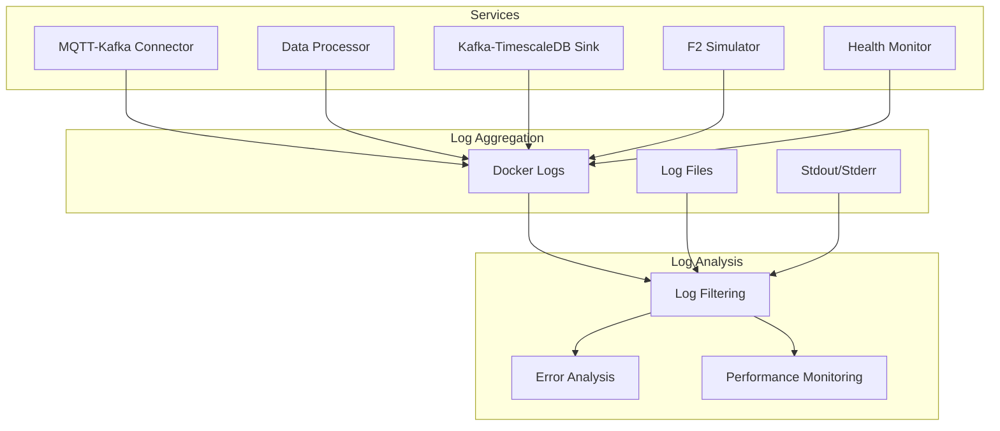

# Logging Guide

> Comprehensive guide to logging, monitoring, and debugging logs in the MQTT Architecture POC

## 📋 Table of Contents
- [Logging Overview](#logging-overview)
- [Log Levels and Usage](#log-levels-and-usage)
- [Service-Specific Logging](#service-specific-logging)
- [Log Format and Structure](#log-format-and-structure)
- [Viewing and Filtering Logs](#viewing-and-filtering-logs)
- [Log Analysis](#log-analysis)
- [Performance Monitoring via Logs](#performance-monitoring-via-logs)
- [Log Management](#log-management)
- [Best Practices](#best-practices)

## 📊 Logging Overview

The MQTT Architecture POC implements **structured logging** across all services with consistent formatting, appropriate log levels, and comprehensive coverage of system operations.

### Enhanced Logging Features

- **Structured format** with timestamps, service names, and file locations
- **Multiple log levels** for different types of information
- **Service-specific logging** with contextual information
- **Performance metrics** embedded in log messages
- **Error tracking** with stack traces for debugging
- **File and console output** (where applicable)

### Logging Architecture



## 📈 Log Levels and Usage

### Log Level Hierarchy

| Level | Usage | Examples | When to Use |
|-------|-------|----------|-------------|
| **DEBUG** | Detailed processing info | Topic parsing, cache hits/misses | Development debugging |
| **INFO** | Normal operations | Successful processing, connections | System monitoring |
| **WARNING** | Non-critical issues | Unknown devices, validation failures | Operational awareness |
| **ERROR** | Service errors | Connection failures, processing errors | Issue investigation |
| **CRITICAL** | System failures | Service crashes, data corruption | Emergency response |

### Log Level Configuration

**Default configuration** (all services):
```python
# Main service logging: INFO level
logging.getLogger(__name__).setLevel(logging.INFO)

# Third-party library logging: WARNING level  
logging.getLogger('kafka').setLevel(logging.WARNING)
logging.getLogger('psycopg2').setLevel(logging.WARNING)
logging.getLogger('paho').setLevel(logging.WARNING)
```

**Temporary debug mode** (set via environment):
```bash
# Enable debug logging for specific service
docker-compose exec data-processor bash -c "export LOG_LEVEL=DEBUG && python processor.py"

# Or restart with debug logging
docker-compose stop data-processor
docker-compose run -e LOG_LEVEL=DEBUG data-processor
```

## 🔍 Service-Specific Logging

### 1. MQTT-Kafka Connector (`services/mqtt_kafka_connector/`)

**Key Log Messages:**
```python
# Connection events
logger.info("Connected to MQTT broker successfully")
logger.info(f"Connected to Kafka at {self.kafka_servers}")

# Message processing
logger.debug(f"Processed message from {topic} for device {device_id}")
logger.warning(f"Could not extract device ID from topic: {topic}")

# Error handling
logger.error(f"Failed to decode MQTT payload for topic {topic}: {e}")
logger.error(f"Unexpected error processing MQTT message: {e}", exc_info=True)
```

**Performance Metrics:**
```python
# Payload size tracking
logger.debug(f"Processed message from {topic} (payload size: {len(payload)} bytes)")

# Kafka delivery confirmation
logger.debug(f"Message sent to Kafka partition {partition} offset {offset}")
```

### 2. Data Processor (`services/data_processor/`)

**Key Log Messages:**
```python
# Database operations
logger.debug(f"Querying data points for {mac_addr}/{connector_number}/{pin_position}")
logger.info(f"Found {len(data_points)} data points for device")

# Processing metrics
logger.info(f"Successfully processed {processed_count} data points in {processing_time:.3f}s")
logger.warning(f"No data points successfully processed from {original_topic}")

# Validation and errors
logger.error(f"Data validation failed for {dp['Label']}: {e}")
logger.debug(f"Failed message data: {message_data}")
```

**Performance Tracking:**
```python
# Processing time measurement
start_time = time.time()
# ... processing logic ...
processing_time = time.time() - start_time
logger.info(f"Processed message in {processing_time:.3f}s")
```

### 3. Kafka-TimescaleDB Sink (`services/kafka_timescale_sink/`)

**Key Log Messages:**
```python
# Batch processing
logger.info(f"Successfully inserted {len(records)} records into TimescaleDB")
logger.warning(f"Failed to prepare {failed_records} records out of {batch_size}")

# Database operations
logger.info("Successfully reconnected to TimescaleDB")
logger.error(f"Database connection error during batch insert: {e}")

# Performance metrics
logger.info(f"Batch processing time: {processing_time:.3f}s")
```

**Batch Tracking:**
```python
# Detailed batch information
logger.info(
    f"Successfully inserted {len(records)} records into TimescaleDB "
    f"(failed: {failed_records}, batch_size: {batch_size}, time: {processing_time:.3f}s)"
)
```

### 4. F2 Simulator (`services/f2_simulator/`)

**Key Log Messages:**
```python
# Device simulation
logger.info(f"Simulating device {device_id} - {device_config['name']}")
logger.debug(f"Generated sensor data for {device_id}: {sensor_data}")

# MQTT publishing
logger.info(f"Published to {topic}: {payload}")
logger.error(f"Failed to publish MQTT message: {e}")
```

### 5. Health Monitor (`monitoring/health_monitor/`)

**Key Log Messages:**
```python
# Health checks
logger.info("Health monitor started successfully")
logger.warning(f"Service {service_name} is unhealthy: {details}")

# System metrics
logger.debug(f"System metrics - CPU: {cpu}%, Memory: {memory}%, Disk: {disk}%")
```

## 📝 Log Format and Structure

### Enhanced Log Format

All services use the enhanced logging format:
```
TIMESTAMP - SERVICE_NAME - LEVEL - [FILE:LINE] - MESSAGE
```

**Example log entries:**
```
2024-01-15 10:30:15,123 - data_processor - INFO - [processor.py:245] - Successfully processed 5 data points from cmnd/f2-e4fd45f654be/sensor-mode/1/sensor-3 in 0.045s

2024-01-15 10:30:15,125 - kafka_timescale_sink - WARNING - [sink.py:118] - Failed to prepare 2 records out of 100

2024-01-15 10:30:15,127 - mqtt_kafka_connector - ERROR - [connector.py:76] - Failed to decode MQTT payload for topic cmnd/invalid: 'utf-8' codec can't decode byte 0xff
```

### Log Structure Components

| Component | Description | Example |
|-----------|-------------|---------|
| **Timestamp** | ISO format with milliseconds | `2024-01-15 10:30:15,123` |
| **Service Name** | Logger name (service identifier) | `data_processor` |
| **Level** | Log level (DEBUG/INFO/WARNING/ERROR) | `INFO` |
| **Location** | Source file and line number | `[processor.py:245]` |
| **Message** | Descriptive log message | `Successfully processed...` |

## 🔧 Viewing and Filtering Logs

### Basic Log Commands

```bash
# View all service logs
make logs

# View specific service logs
make logs-processor     # Data processor
make logs-sink         # TimescaleDB sink  
make logs-connector    # MQTT-Kafka connector
make logs-simulator    # F2 device simulator

# Follow logs in real-time
docker-compose logs -f

# View logs with timestamps
docker-compose logs -t
```

### Advanced Log Filtering

#### Filter by Log Level
```bash
# Show only errors across all services
docker-compose logs | grep "ERROR"

# Show warnings and errors
docker-compose logs | grep -E "(WARNING|ERROR)"

# Show info and above (exclude debug)
docker-compose logs | grep -E "(INFO|WARNING|ERROR|CRITICAL)"
```

#### Filter by Service
```bash
# Specific service logs
docker-compose logs data-processor

# Multiple services
docker-compose logs data-processor kafka-timescale-sink

# Exclude specific services
docker-compose logs | grep -v "f2-simulator"
```

#### Filter by Time
```bash
# Logs from last hour
docker-compose logs --since="1h"

# Logs from specific time
docker-compose logs --since="2024-01-15T10:30:00"

# Logs between time periods (combine with grep)
docker-compose logs --since="2024-01-15T10:00:00" --until="2024-01-15T11:00:00"
```

#### Filter by Content
```bash
# Search for specific device
docker-compose logs | grep "f2-e4fd45f654be"

# Search for processing metrics
docker-compose logs | grep "processing time"

# Search for database operations
docker-compose logs | grep -i "database\|postgres\|timescale"

# Search for validation errors
docker-compose logs | grep "validation failed"
```

### Complex Filtering Examples

```bash
# Find all errors in the last 30 minutes
docker-compose logs --since="30m" | grep "ERROR"

# Monitor real-time processing for specific device
docker-compose logs -f | grep "f2-e4fd45f654be"

# Check batch processing performance
docker-compose logs kafka-timescale-sink | grep "inserted batch" | tail -10

# Find connection issues
docker-compose logs | grep -i "connection\|refused\|timeout"

# Monitor data validation issues
docker-compose logs data-processor | grep -E "(validation|ValidationError)"
```

## 📊 Log Analysis

### Performance Analysis

#### Processing Time Analysis
```bash
# Extract processing times from logs
docker-compose logs data-processor | grep "processing time" | \
    sed -E 's/.*in ([0-9.]+)s/\1/' | \
    awk '{sum+=$1; count++} END {print "Avg:", sum/count "s"}'

# Find slowest processing times
docker-compose logs data-processor | grep "processing time" | \
    sort -k9 -n | tail -10
```

#### Batch Size Analysis
```bash
# Analyze TimescaleDB batch sizes
docker-compose logs kafka-timescale-sink | grep "inserted batch" | \
    sed -E 's/.*inserted ([0-9]+) records.*/\1/' | \
    awk '{sum+=$1; count++} END {print "Total records:", sum, "Avg batch:", sum/count}'
```

#### Error Rate Analysis
```bash
# Count errors by service
docker-compose logs | grep "ERROR" | \
    awk '{print $3}' | sort | uniq -c | sort -nr

# Error trends over time
docker-compose logs --since="1h" | grep "ERROR" | \
    awk '{print $1, $2}' | cut -c1-16 | uniq -c
```

### Data Quality Analysis

#### Validation Failures
```bash
# Count validation failures by type
docker-compose logs | grep "validation failed" | \
    awk -F: '{print $NF}' | sort | uniq -c

# Failed device lookups
docker-compose logs data-processor | grep "No data points found" | \
    grep -o "f2-[a-fA-F0-9]*" | sort | uniq -c
```

#### Message Processing Stats
```bash
# Successful message processing
docker-compose logs data-processor | grep "Successfully processed" | \
    wc -l

# Failed message processing  
docker-compose logs data-processor | grep "No data points successfully processed" | \
    wc -l
```

## ⚡ Performance Monitoring via Logs

### Key Performance Indicators (KPIs)

#### 1. Message Processing Rate
```bash
# Messages processed per minute
docker-compose logs data-processor --since="1h" | \
    grep "Successfully processed" | \
    awk '{print $1, $2}' | cut -c1-16 | uniq -c
```

#### 2. Database Insert Performance  
```bash
# Average batch insert time
docker-compose logs kafka-timescale-sink | \
    grep "time:" | \
    sed -E 's/.*time: ([0-9.]+)s.*/\1/' | \
    awk '{sum+=$1; count++} END {print "Avg insert time:", sum/count "s"}'
```

#### 3. Error Rates
```bash
# Error rate percentage
total_logs=$(docker-compose logs --since="1h" | wc -l)
error_logs=$(docker-compose logs --since="1h" | grep "ERROR" | wc -l)
echo "Error rate: $(echo "scale=2; $error_logs * 100 / $total_logs" | bc)%"
```

### Performance Alerts

Create monitoring scripts for key metrics:

```bash
#!/bin/bash
# performance_monitor.sh

# Check error rate
error_rate=$(docker-compose logs --since="5m" | grep "ERROR" | wc -l)
if [ $error_rate -gt 10 ]; then
    echo "HIGH ERROR RATE: $error_rate errors in last 5 minutes"
fi

# Check processing time
avg_time=$(docker-compose logs data-processor --since="5m" | \
    grep "processing time" | \
    sed -E 's/.*in ([0-9.]+)s/\1/' | \
    awk '{sum+=$1; count++} END {print sum/count}')

if (( $(echo "$avg_time > 1.0" | bc -l) )); then
    echo "SLOW PROCESSING: Average time $avg_time seconds"
fi
```

## 🗂️ Log Management

### Log Retention

**Docker log management:**
```bash
# Check log sizes
docker system df

# Clean up old logs (removes all container logs)
docker system prune -a

# Configure log rotation in docker-compose.yml
services:
  data-processor:
    logging:
      driver: "json-file"
      options:
        max-size: "10m"
        max-file: "3"
```

### Log Collection for Analysis

```bash
# Collect logs for specific time period
mkdir logs_$(date +%Y%m%d_%H%M%S)
cd logs_$(date +%Y%m%d_%H%M%S)

# Export service logs
docker-compose logs --since="1h" --no-color data-processor > processor.log
docker-compose logs --since="1h" --no-color kafka-timescale-sink > sink.log
docker-compose logs --since="1h" --no-color mqtt-kafka-connector > connector.log

# Create analysis summary
echo "Log Analysis Summary" > summary.txt
echo "===================" >> summary.txt
echo "Time period: Last 1 hour" >> summary.txt
echo "Total log lines: $(cat *.log | wc -l)" >> summary.txt
echo "Error count: $(cat *.log | grep ERROR | wc -l)" >> summary.txt
echo "Warning count: $(cat *.log | grep WARNING | wc -l)" >> summary.txt
```

### Log Shipping (Production)

For production deployments, consider log aggregation:

```yaml
# docker-compose.yml - Example log shipping configuration
services:
  data-processor:
    logging:
      driver: "fluentd"
      options:
        fluentd-address: "fluentd:24224"
        tag: "iot.data-processor"
        
  # Or use centralized logging
  logstash:
    image: docker.elastic.co/logstash/logstash:8.0.0
    volumes:
      - ./logstash/config:/usr/share/logstash/pipeline
```

## ✅ Best Practices

### Development Logging

1. **Use appropriate log levels**:
   - **DEBUG**: Detailed tracing information
   - **INFO**: Confirmation of expected behavior
   - **WARNING**: Something unexpected but recoverable
   - **ERROR**: Serious problem that prevented functionality
   - **CRITICAL**: Very serious error that may abort program

2. **Include context in log messages**:
   ```python
   # Good: Contextual information
   logger.info(f"Successfully processed {count} records for device {device_id} in {time:.3f}s")
   
   # Bad: Vague message
   logger.info("Processing completed")
   ```

3. **Log performance metrics**:
   ```python
   start_time = time.time()
   # ... processing ...
   processing_time = time.time() - start_time
   logger.info(f"Operation completed in {processing_time:.3f}s")
   ```

4. **Use structured logging for important events**:
   ```python
   logger.info(
       f"Database batch insert: "
       f"records={len(records)}, "
       f"failed={failed_count}, "
       f"time={processing_time:.3f}s"
   )
   ```

### Production Logging

1. **Implement log rotation** to prevent disk space issues
2. **Set appropriate log levels** (INFO for production, DEBUG for troubleshooting)
3. **Use centralized logging** for distributed systems
4. **Monitor log volume** and adjust levels if needed
5. **Set up alerts** for error patterns
6. **Regularly analyze logs** for trends and issues

### Security Considerations

1. **Never log sensitive data**:
   ```python
   # Bad: Logs sensitive information
   logger.info(f"User credentials: {username}:{password}")
   
   # Good: Logs without sensitive data
   logger.info(f"Authentication attempt for user: {username}")
   ```

2. **Sanitize user input** before logging
3. **Use log levels** to control information exposure
4. **Secure log files** with appropriate permissions

## 🔗 Related Documentation

- **[Debugging Guide](DEBUGGING.md)** - Using logs for troubleshooting
- **[TimescaleDB Guide](TIMESCALE.md)** - Database operation logs
- **[Developer Guide](DEVELOPER_GUIDE.md)** - Development logging practices
- **[Health Monitoring](monitoring/health-monitor.md)** - Health check logs

## 📞 Quick Reference

### Essential Log Commands
```bash
# Quick system health check via logs
make logs | grep -E "(ERROR|CRITICAL)" | tail -10

# Monitor processing in real-time
make logs-processor | grep "Successfully processed"

# Check recent errors
docker-compose logs --since="10m" | grep ERROR

# Performance monitoring
docker-compose logs | grep "time:" | tail -10
```

### Log Investigation Workflow
1. **Identify the issue** (error message, performance problem)
2. **Check recent logs** for the relevant service
3. **Filter by time period** when issue occurred
4. **Look for patterns** in error messages
5. **Check related services** for cascading issues
6. **Analyze performance metrics** in logs
7. **Correlate with system health** endpoints