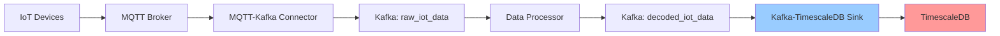

# TimescaleDB Guide

> Complete guide to TimescaleDB usage, optimization, and debugging in the MQTT Architecture POC

## 📋 Table of Contents
- [What is TimescaleDB?](#what-is-timescaledb)
- [How TimescaleDB Works in Our Project](#how-timescaledb-works-in-our-project)
- [Database Schema](#database-schema)
- [Performance Features](#performance-features)
- [Debugging and Monitoring](#debugging-and-monitoring)
- [Common Operations](#common-operations)
- [Troubleshooting](#troubleshooting)
- [Performance Optimization](#performance-optimization)

## What is TimescaleDB?

**TimescaleDB** is a time-series database built on PostgreSQL that provides:
- **Automatic partitioning** by time intervals (hypertables)
- **Compression** for older data to save storage
- **Continuous aggregates** for real-time analytics
- **Retention policies** for automated data cleanup
- **All PostgreSQL features** (SQL, indexes, transactions)

**📖 Official Documentation**: https://docs.timescale.com/

### Why We Use TimescaleDB

| Feature | Benefit for IoT Data |
|---------|---------------------|
| **Hypertables** | Automatic partitioning handles millions of IoT measurements |
| **Compression** | Reduces storage costs by 90%+ for older data |
| **Time-based queries** | Optimized for "last 24 hours" type queries |
| **PostgreSQL compatibility** | Use existing SQL knowledge and tools |
| **Horizontal scaling** | Can scale across multiple nodes |

## How TimescaleDB Works in Our Project

### 1. Data Flow to TimescaleDB



### 2. Our Implementation

**Service**: `services/kafka_timescale_sink/sink.py`

**Key Features**:
- **Batch processing**: Processes 100-1000 records at once
- **Data validation**: Uses Pydantic models for data integrity
- **Error handling**: Graceful handling of invalid data
- **Configurable batching**: Adjustable batch size and timeout

**Configuration**:
```yaml
# docker-compose.yml
timescaledb:
  image: timescale/timescaledb:latest-pg15
  environment:
    POSTGRES_DB: timeseries
    POSTGRES_USER: ts_user
    POSTGRES_PASSWORD: ts_password
  ports:
    - "5433:5432"
```

## Database Schema

### Main Table: `iot_measurements`

```sql
CREATE TABLE iot_measurements (
    timestamp TIMESTAMPTZ NOT NULL,
    device_id TEXT NOT NULL,
    connector_mode TEXT NOT NULL,
    datapoint_label TEXT NOT NULL,
    pin_position TEXT NOT NULL,
    value DOUBLE PRECISION,
    unit TEXT,
    topic TEXT
);

-- Convert to hypertable (enables time-series features)
SELECT create_hypertable('iot_measurements', 'timestamp');
```

### Indexes for Performance

```sql
-- Primary time-based index (automatic)
-- Multi-column indexes for common queries
CREATE INDEX idx_iot_device_time ON iot_measurements (device_id, timestamp DESC);
CREATE INDEX idx_iot_datapoint_time ON iot_measurements (datapoint_label, timestamp DESC);
CREATE INDEX idx_iot_recent ON iot_measurements (timestamp DESC) WHERE timestamp > NOW() - INTERVAL '1 hour';
```

### Sample Data

```sql
-- Example IoT measurement record
INSERT INTO iot_measurements VALUES (
    '2024-01-15 10:30:00+00',  -- timestamp
    'f2-e4fd45f654be',         -- device_id
    'sensor-mode',             -- connector_mode
    'Temperature',             -- datapoint_label
    '3',                       -- pin_position
    23.7,                      -- value
    '°C',                      -- unit
    'cmnd/f2-e4fd45f654be/sensor-mode/1/sensor-3'  -- topic
);
```

## Performance Features

### 1. Hypertables (Automatic Partitioning)

TimescaleDB automatically partitions data by time:

```sql
-- View chunk information
SELECT * FROM timescaledb_information.chunks 
WHERE hypertable_name = 'iot_measurements';

-- Typical chunk size: 7 days
-- Automatic creation as data arrives
```

### 2. Compression

Our setup includes compression for older data:

```sql
-- Enable compression (already configured)
ALTER TABLE iot_measurements SET (
    timescaledb.compress,
    timescaledb.compress_segmentby = 'device_id',
    timescaledb.compress_orderby = 'timestamp DESC'
);

-- Automatic compression after 1 day
SELECT add_compression_policy('iot_measurements', INTERVAL '1 day');
```

**Compression Benefits**:
- **90%+ storage reduction** for older data
- **Faster queries** for compressed data
- **Automatic background process**

### 3. Retention Policies

```sql
-- Automatically delete data older than 30 days
SELECT add_retention_policy('iot_measurements', INTERVAL '30 days');
```

## Debugging and Monitoring

### 1. Database Connection

```bash
# Connect to TimescaleDB
make db-timescale

# Or manually:
docker exec -it timescale-db psql -U ts_user -d timeseries
```

### 2. Check System Health

```sql
-- Check hypertable status
SELECT * FROM timescaledb_information.hypertables;

-- Check chunk information
SELECT 
    chunk_schema,
    chunk_name,
    range_start,
    range_end,
    compressed_chunk_id IS NOT NULL AS is_compressed
FROM timescaledb_information.chunks 
WHERE hypertable_name = 'iot_measurements'
ORDER BY range_start DESC
LIMIT 10;

-- Check compression status
SELECT 
    pg_size_pretty(before_compression_bytes) AS before,
    pg_size_pretty(after_compression_bytes) AS after,
    round(after_compression_bytes::NUMERIC/before_compression_bytes::NUMERIC*100, 2) AS ratio
FROM timescaledb_information.compression_settings
WHERE hypertable_name = 'iot_measurements';
```

### 3. Monitor Data Ingestion

```sql
-- Recent data ingestion rate
SELECT 
    date_trunc('minute', timestamp) AS minute,
    COUNT(*) AS records_per_minute
FROM iot_measurements 
WHERE timestamp > NOW() - INTERVAL '1 hour'
GROUP BY minute
ORDER BY minute DESC
LIMIT 10;

-- Data distribution by device
SELECT 
    device_id,
    COUNT(*) AS total_records,
    MIN(timestamp) AS first_record,
    MAX(timestamp) AS latest_record
FROM iot_measurements
GROUP BY device_id
ORDER BY total_records DESC;
```

### 4. Log Analysis

Check sink service logs for TimescaleDB operations:

```bash
# View TimescaleDB sink logs
make logs-sink

# Filter for specific issues
docker-compose logs kafka-timescale-sink | grep -i error
docker-compose logs kafka-timescale-sink | grep -i "inserted batch"
```

## Common Operations

### 1. Query Examples

```sql
-- Get latest readings for a device
SELECT * FROM iot_measurements 
WHERE device_id = 'f2-e4fd45f654be'
ORDER BY timestamp DESC
LIMIT 10;

-- Average temperature over last hour
SELECT 
    date_trunc('minute', timestamp) AS minute,
    AVG(value) AS avg_temp
FROM iot_measurements 
WHERE datapoint_label = 'Temperature'
  AND timestamp > NOW() - INTERVAL '1 hour'
GROUP BY minute
ORDER BY minute;

-- Device activity summary
SELECT 
    device_id,
    datapoint_label,
    COUNT(*) AS readings,
    AVG(value) AS avg_value,
    MIN(value) AS min_value,
    MAX(value) AS max_value
FROM iot_measurements
WHERE timestamp > NOW() - INTERVAL '24 hours'
GROUP BY device_id, datapoint_label
ORDER BY device_id, datapoint_label;
```

### 2. Maintenance Operations

```sql
-- Manual compression of older chunks
SELECT compress_chunk(i) FROM show_chunks('iot_measurements', older_than => INTERVAL '1 day') i;

-- View database size
SELECT 
    schemaname,
    tablename,
    pg_size_pretty(pg_total_relation_size(schemaname||'.'||tablename)) AS size
FROM pg_tables 
WHERE schemaname = 'public'
ORDER BY pg_total_relation_size(schemaname||'.'||tablename) DESC;

-- Check active connections
SELECT count(*) FROM pg_stat_activity WHERE datname = 'timeseries';
```

## Troubleshooting

### Common Issues

#### 1. Connection Problems

**Symptom**: Sink service can't connect to TimescaleDB
```
Error: FATAL: database "timeseries" does not exist
```

**Solution**:
```bash
# Check if TimescaleDB container is running
docker-compose ps timescaledb

# Check initialization logs
docker-compose logs timescaledb

# Verify database exists
docker exec timescale-db psql -U ts_user -l
```

#### 2. Batch Insert Failures

**Symptom**: Sink logs show validation errors
```
Data validation failed: [ValidationError] - for message: {...}
```

**Solution**:
```bash
# Check message format in Kafka
make kafka-decoded

# Verify shared model validation
docker-compose logs kafka-timescale-sink | grep -A5 -B5 "validation failed"
```

#### 3. Performance Issues

**Symptom**: Slow queries or high CPU usage

**Diagnosis**:
```sql
-- Check slow queries
SELECT 
    query,
    calls,
    total_time,
    mean_time
FROM pg_stat_statements 
ORDER BY total_time DESC 
LIMIT 10;

-- Check table sizes
SELECT 
    schemaname,
    tablename,
    pg_size_pretty(pg_total_relation_size(schemaname||'.'||tablename))
FROM pg_tables 
WHERE schemaname = 'public';
```

**Solutions**:
1. **Enable compression** for older data
2. **Add indexes** for common query patterns
3. **Increase batch size** in sink configuration
4. **Check retention policies** to prevent unlimited growth

### 4. Data Quality Issues

**Symptom**: Missing or incorrect data

**Diagnosis**:
```sql
-- Check for data gaps
SELECT 
    device_id,
    datapoint_label,
    timestamp,
    LAG(timestamp) OVER (PARTITION BY device_id, datapoint_label ORDER BY timestamp) AS prev_timestamp,
    timestamp - LAG(timestamp) OVER (PARTITION BY device_id, datapoint_label ORDER BY timestamp) AS gap
FROM iot_measurements
WHERE timestamp > NOW() - INTERVAL '1 hour'
ORDER BY device_id, datapoint_label, timestamp;

-- Check for invalid values
SELECT 
    device_id,
    datapoint_label,
    COUNT(*) AS total,
    COUNT(value) AS valid_values,
    COUNT(*) - COUNT(value) AS null_values
FROM iot_measurements
WHERE timestamp > NOW() - INTERVAL '1 hour'
GROUP BY device_id, datapoint_label;
```

## Performance Optimization

### 1. Batch Configuration

**File**: `services/kafka_timescale_sink/sink.py`

```python
# Optimize batch settings
self.batch_size = int(os.getenv('BATCH_SIZE', '1000'))  # Increase from 100
self.batch_timeout = int(os.getenv('BATCH_TIMEOUT', '10'))  # Less frequent
```

### 2. Connection Pooling

```python
# Add connection pooling (recommended)
from psycopg2.pool import ThreadedConnectionPool

self.db_pool = ThreadedConnectionPool(
    minconn=1,
    maxconn=10,
    host=self.ts_host,
    port=self.ts_port,
    database=self.ts_db,
    user=self.ts_user,
    password=self.ts_password
)
```

### 3. Bulk Insert Optimization

```python
# Use COPY instead of INSERT for better performance
import io
import csv

def bulk_insert_with_copy(self, records):
    csv_data = io.StringIO()
    csv_writer = csv.writer(csv_data)
    
    for record in records:
        csv_writer.writerow(record)
    
    csv_data.seek(0)
    
    with self.db_connection.cursor() as cursor:
        cursor.copy_from(
            csv_data,
            'iot_measurements',
            columns=('timestamp', 'device_id', 'connector_mode', 'datapoint_label', 'pin_position', 'value', 'unit', 'topic'),
            sep=','
        )
```

### 4. Monitoring Queries

```sql
-- Create monitoring views
CREATE VIEW recent_activity AS
SELECT 
    date_trunc('minute', timestamp) AS minute,
    device_id,
    COUNT(*) AS records
FROM iot_measurements
WHERE timestamp > NOW() - INTERVAL '1 hour'
GROUP BY minute, device_id
ORDER BY minute DESC;

-- Performance metrics
CREATE VIEW compression_stats AS
SELECT 
    chunk_name,
    pg_size_pretty(before_compression_bytes) AS before,
    pg_size_pretty(after_compression_bytes) AS after,
    round(after_compression_bytes::NUMERIC/before_compression_bytes::NUMERIC*100, 2) AS compression_ratio
FROM timescaledb_information.compression_settings
WHERE hypertable_name = 'iot_measurements';
```

## 🔗 Related Documentation

- **[Architecture Overview](architecture/overview.md)** - How TimescaleDB fits in the system
- **[Kafka-TimescaleDB Sink](architecture/kafka-timescale-sink.md)** - Service implementation details
- **[Debugging Guide](DEBUGGING.md)** - General troubleshooting
- **[Performance Guide](PERFORMANCE.md)** - System optimization

## 📚 External Resources

- **[TimescaleDB Documentation](https://docs.timescale.com/)**
- **[TimescaleDB Best Practices](https://docs.timescale.com/timescaledb/latest/best-practices/)**
- **[PostgreSQL Performance Tuning](https://wiki.postgresql.org/wiki/Performance_Optimization)**
- **[Time-Series Data Modeling](https://docs.timescale.com/timescaledb/latest/how-to-guides/data-modeling/)**