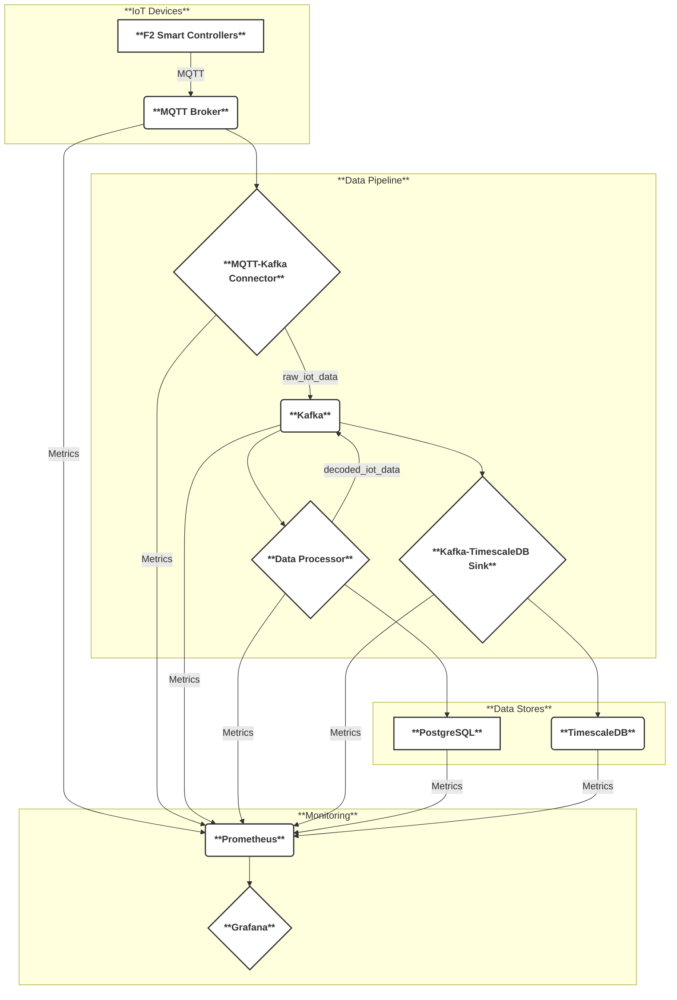
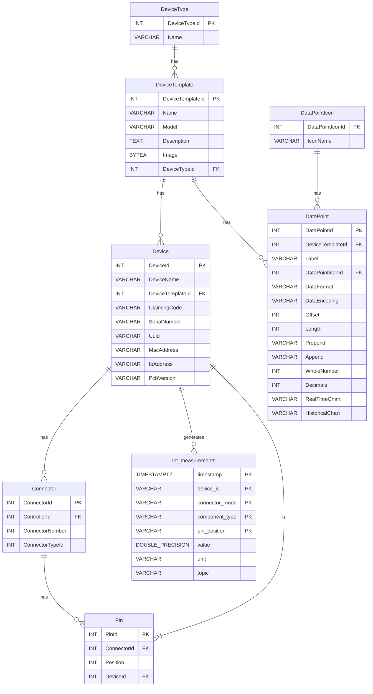

# MQTT Architecture POC - System Overview

## System Architecture

This document provides a comprehensive overview of the MQTT Architecture Proof of Concept (POC) system, designed for ingesting, processing, and storing IoT data from F2 Smart Controller devices.

## High-Level Architecture Diagram

## Core Components

### 1. **F2 Smart Controllers** (Simulated)
- **Purpose**: IoT devices that generate sensor data
- **Output**: MQTT messages with various sensor readings
- **Topics**: `cmnd/f2-<MAC_ADDR>/<MODE>/<CONNECTOR>/<COMPONENT>-<ID>`

### 2. **MQTT Broker (Mosquitto)**
- **Purpose**: Central message hub for all F2 device communications
- **Port**: 1883 (MQTT), 9001 (WebSocket)
- **Configuration**: `/mosquitto/mosquitto.conf`

### 3. **MQTT-Kafka Connector**
- **Purpose**: Bridges MQTT messages to Kafka topics
- **Input**: MQTT messages from `cmnd/#` pattern
- **Output**: Kafka topic `raw_iot_data`
- **Language**: Python with `paho-mqtt` and `kafka-python`

### 4. **Apache Kafka**
- **Purpose**: Message streaming platform and buffer
- **Topics**: 
  - `raw_iot_data` - Raw MQTT messages
  - `decoded_iot_data` - Processed IoT data
- **Port**: 9092

### 5. **PostgreSQL (Device Parameters)**
- **Purpose**: Stores device metadata and processing parameters
- **Database**: `device_params`
- **Port**: 5432
- **Key Table**: `device_parameters`

### 6. **Data Processor**
- **Purpose**: Transforms raw IoT data into meaningful measurements
- **Input**: Kafka topic `raw_iot_data`
- **Output**: Kafka topic `decoded_iot_data`
- **Language**: Python with database lookups

### 7. **TimescaleDB**
- **Purpose**: Time-series data storage for analytics
- **Database**: `timeseries`
- **Port**: 5433
- **Key Table**: `iot_measurements` (hypertable)

### 8. **Kafka-TimescaleDB Sink**
- **Purpose**: Writes processed data to TimescaleDB
- **Input**: Kafka topic `decoded_iot_data`
- **Output**: TimescaleDB `iot_measurements` table
- **Features**: Batch processing, error handling

## Data Flow

1.  **F2 Simulators** publish MQTT messages to topics like `cmnd/f2-{MAC}/{MODE}/{CONNECTOR}/{COMPONENT}`
2.  **MQTT-Kafka Connector** subscribes to `cmnd/#` and forwards to Kafka topic `raw_iot_data`
3.  **Data Processor** consumes `raw_iot_data`, looks up device parameters in PostgreSQL, and publishes enriched data to `decoded_iot_data`
4.  **Kafka-TimescaleDB Sink** consumes `decoded_iot_data` and batch-inserts into TimescaleDB `iot_measurements` hypertable

## Database Schema

## Network Configuration

All components run in the `iot-network` Docker network bridge, enabling inter-service communication using service names as hostnames.

## Scalability Design

- **Horizontal Scaling**: Each Python service can be scaled independently
- **Kafka Partitioning**: Topics can be partitioned for parallel processing
- **Database Optimization**: TimescaleDB provides automatic partitioning and compression
- **Batch Processing**: Sink service uses configurable batch sizes for optimal throughput

## Security Considerations

- **Network Isolation**: All services run in isolated Docker network
- **Database Access**: Separate databases with distinct credentials
- **No External Exposure**: Only necessary ports exposed to host system
- **Logging**: Comprehensive logging without sensitive data exposure