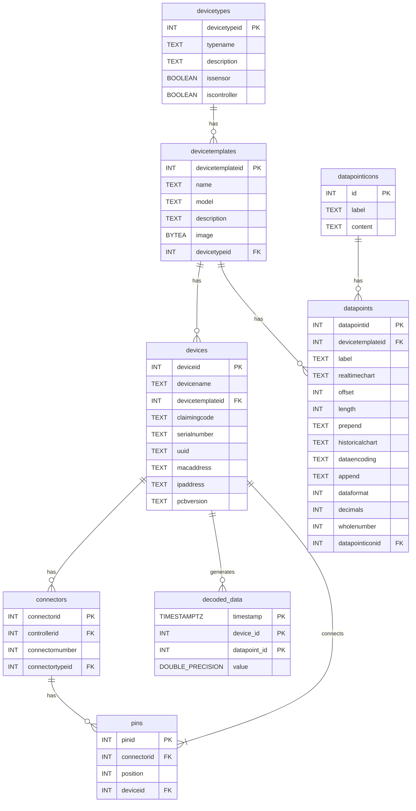

## Database Schema

The database contains devices that can function as controllers or as devices that connect to controllers. Each device is created from a `DeviceTemplate`, and each `DeviceTemplate` has data points that help decode the raw data.

The architecture supports F2 Smart Controllers with 4 connectors (J1-J4) each, where sensors connect through pins. The stream processor maps MQTT data from controllers to the actual sensor devices that generated the data.



## Data Flow and Processing Architecture

The IoT data pipeline uses these database structures to transform raw MQTT messages into structured time-series data:

### 1. **MQTT Topic Structure**
F2 Smart Controllers publish data using the pattern:
```
tele/f2-{mac_address}/{mode}/{connector}/{component}
```
- **Example**: `tele/f2-aabbccddee01/sensor-mode/J1/sensor-1`
- **Components**: J1-J4 (connectors), sensor-1/sensor-2 (components)

### 2. **Stream Processing Pipeline**
The stream processor performs complex mapping:
1. **MAC → Controller**: Maps MQTT MAC address to controller device ID
2. **Controller + Connector + Component → Sensor**: Maps to specific sensor device ID and datapoint ID
3. **Hex Data → Value**: Decodes hex payload using datapoint metadata
4. **Final Output**: Stores data attributed to the sensor device (not controller)

### 3. **Redis Caching Strategy**
High-performance caching with 1-hour TTL:
- `device_mac:{mac}` → Device ID mappings
- `sensor_mapping:{controller_id}:{connector}:{sensor_num}` → Sensor device + datapoint IDs
- `datapoint_metadata:{datapoint_id}` → Hex decoding parameters

### 4. **TimescaleDB Optimization**
The `decoded_data` table uses integer IDs for space efficiency:
- **device_id**: References the sensor device (not controller)
- **datapoint_id**: References specific sensor measurement type
- **Space Savings**: ~70% reduction vs. string-based schema

## Sample Data Model

### Device Types
```sql
INSERT INTO "VtDevice".devicetypes (typename, description, issensor, iscontroller) VALUES 
('F2 Controller', 'F2 Smart Controller Device', false, true),
('Environmental Sensor', 'Temperature, Humidity, CO2 Sensor', true, false),
('Power Monitor', 'Voltage and Current Monitor', true, false);
```

### Device Templates
```sql
-- Environmental Sensor Template
INSERT INTO "VtDevice".devicetemplates (name, model, description, devicetypeid) VALUES 
('Environmental Sensor', 'ENV-S1', 'Environmental Sensor for Temp, Humidity, and CO2', 2);

-- Data Points for Environmental Sensor
INSERT INTO "VtDevice".datapoints (devicetemplateid, label, dataencoding, offset, length, decimals, prepend, append, realtimechart, historicalchart) VALUES
(1, 'Temperature', 'Int16', 6, 2, 2, '', ' °C', 'gauge', 'line'),
(1, 'Humidity', 'Uint16', 8, 2, 2, '', ' %', 'gauge', 'line'),
(1, 'CO2', 'Uint16', 10, 2, 0, '', ' ppm', 'gauge', 'line');
```

### F2 Controller Architecture
```sql
-- F2 Controller with MAC address
INSERT INTO "VtDevice".devices (devicename, devicetemplateid, claimingcode, macaddress) VALUES 
('F2 Controller 1', 1, 'claim-abc', 'aabbccddee01');

-- J1-J4 Connectors
INSERT INTO "VtDevice".connectors (controllerid, connectornumber, connectortypeid) VALUES 
(1, 1, 3), (1, 2, 3), (1, 3, 3), (1, 4, 3);

-- Environmental Sensor connected to J1, Pin 1
INSERT INTO "VtDevice".devices (devicename, devicetemplateid, claimingcode) VALUES 
('Living Room Env Sensor', 2, 'claim-env1');

INSERT INTO "VtDevice".pins (connectorid, position, deviceid) VALUES 
(1, 1, 5);  -- J1, Position 1, Environmental Sensor
```

### Data Processing Example

**MQTT Message**:
```json
{
  "topic": "tele/f2-aabbccddee01/sensor-mode/J1/sensor-1",
  "payload": {
    "timestamp": "2024-07-15 14:30:25.123456",
    "data": "01 03 0C 32 30 32 30 36 32 38 30 31 30 31 5B 18 28 01"
  }
}
```

**Stream Processor Mapping**:
1. `f2-aabbccddee01` → Controller Device ID `1`
2. `J1` + `sensor-1` → Connector `1`, Position `1` → Environmental Sensor Device ID `5`
3. Environmental Sensor + Template → Temperature Datapoint ID `1`
4. Hex data `32 30` at offset 6 → Temperature value `25.52°C`

**TimescaleDB Storage**:
```sql
INSERT INTO decoded_data (timestamp, device_id, datapoint_id, value) VALUES
('2024-07-15 14:30:25.123456+00', 5, 1, 25.52);
```

This architecture enables efficient storage and querying of IoT sensor data while maintaining clear traceability from MQTT messages to database records.
