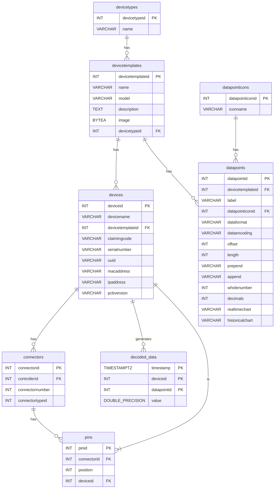

## Database Schema

The database contains devices that can function as controllers or as devices that connect to controllers. Each device is created from a `DeviceTemplate`, and each `DeviceTemplate` has data points that help decode the raw data.




### Device

```csharp
public class Device
{
    public int deviceid { get; set; }
    public string devicename { get; set; } = null!;
    public int devicetemplateid { get; set; }
    public virtual DeviceTemplate DeviceTemplate { get; set; } = null!;
    public string claimingcode { get; set; } = null!;
    public string? serialnumber { get; set; } = null!;
    public string? uuid { get; set; } = null!;
    public string? macaddress { get; set; } = null!;
    public string? ipaddress { get; set; } = null!;
    public string? pcbversion { get; set; }
    public virtual IEnumerable<DeviceConnectivity> DeviceConnectivities { get; set; } = null!;
    public virtual DeviceClaim ClaimDevice { get; set; } = null!;
}
```

### DeviceTemplate

```csharp
public class DeviceTemplate
{
    public int devicetemplateid { get; set; }
    public string name { get; set; } = null!;
    public string model { get; set; } = null!;
    public string description { get; set; } = null!;
    public byte[]? image { get; set; }
    public int devicetypeid { get; set; }
    public virtual DeviceType DeviceType { get; set; } = null!;
    public virtual IEnumerable<DeviceTemplateCommunication> Communications { get; set; } = null!;
    public virtual IEnumerable<DeviceTemplateAuthentication> Authentications { get; set; } = null!;
    public virtual IEnumerable<DeviceTemplatePower> Powers { get; set; } = null!;
    public virtual IEnumerable<DataPoint> DataPoints { get; set; } = null!;        
}
```

### DataPoint

```csharp
public class DataPoint
{
    public int datapointid { get; set; }
    public int devicetemplateid { get; set; }
    public virtual DeviceTemplate DeviceTemplate { get; set; } = null!;
    public string label { get; set; } = null!;
    public int datapointiconid { get; set; }
    public virtual DataPointIcon DataPointIcon { get; set; } = null!;
    public DeviceManagementConstants.DataFormat dataformat { get; set; }
    public DeviceManagementConstants.DataEncoding dataencoding { get; set; }
    public int offset { get; set; }
    public int length { get; set; }
    public string prepend { get; set; } = string.Empty;
    public string append { get; set; } = string.Empty;
    public int wholenumber { get; set; } = 0;
    public int decimals { get; set; } = 0;
    public DeviceManagementConstants.ChartType realtimechart { get; set; }
    public DeviceManagementConstants.ChartType historicalchart { get; set; }
}
```

### Controller

A controller is a type of device that has connectors. Each connector has pins, and each pin has a connected device with different functionality. Here we focus on serial sensor types.

### Connector

```csharp
public class Connector
{
    [Key]
    [DatabaseGenerated(DatabaseGeneratedOption.Identity)]
    public int connectorid { get; set; }
    public int controllerid { get; set; }
    public virtual Device Controller { get; set; } = null!;
    [Range(1, 5)]
    public int connectornumber { get; set; }
    public int connectortypeid { get; set; }
    public virtual ConnectorType ConnectorType { get; set; } = null!;
    public virtual IEnumerable<Pin> Pins { get; set; } = null!;
}
```

### Pin

```csharp
public class Pin
{
    [Key]
    [DatabaseGenerated(DatabaseGeneratedOption.Identity)]
    public int pinid { get; set; }
    public int connectorid { get; set; }
    public virtual Connector Connector { get; set; } = null!;
    public int position { get; set; }
    public int deviceid { get; set; }
    public virtual Device Device { get; set; } = null!;
}
```
