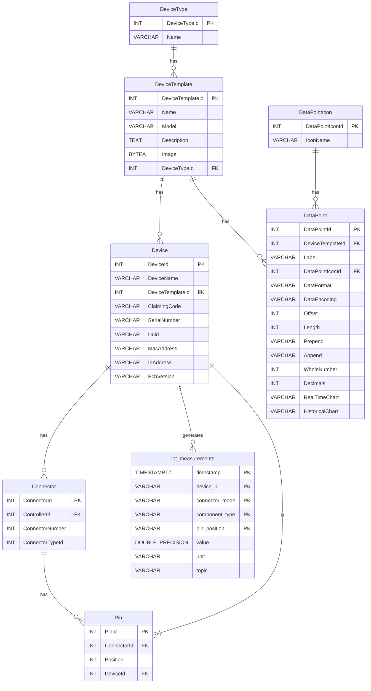

## Database Schema

The database contains devices that can function as controllers or as devices that connect to controllers. Each device is created from a `DeviceTemplate`, and each `DeviceTemplate` has data points that help decode the raw data.




### Device

```csharp
public class Device
{
    public int DeviceId { get; set; }
    public string DeviceName { get; set; } = null!;
    public int DeviceTemplateId { get; set; }
    public virtual DeviceTemplate DeviceTemplate { get; set; } = null!;
    public string ClaimingCode { get; set; } = null!;
    public string? SerialNumber { get; set; } = null!;
    public string? Uuid { get; set; } = null!;
    public string? MacAddress { get; set; } = null!;
    public string? IpAddress { get; set; } = null!;
    public string? PcbVersion { get; set; }
    public virtual IEnumerable<DeviceConnectivity> DeviceConnectivities { get; set; } = null!;
    public virtual DeviceClaim ClaimDevice { get; set; } = null!;
}
```

### DeviceTemplate

```csharp
public class DeviceTemplate
{
    public int DeviceTemplateId { get; set; }
    public string Name { get; set; } = null!;
    public string Model { get; set; } = null!;
    public string Description { get; set; } = null!;
    public byte[]? Image { get; set; }
    public int DeviceTypeId { get; set; }
    public virtual DeviceType DeviceType { get; set; } = null!;
    public virtual IEnumerable<DeviceTemplateCommunication> Communications { get; set; } = null!;
    public virtual IEnumerable<DeviceTemplateAuthentication> Authentications { get; set; } = null!;
    public virtual IEnumerable<DeviceTemplatePower> Powers { get; set; } = null!;
    public virtual IEnumerable<DataPoint> DataPoints { get; set; } = null!;        
}
```

### DataPoint

```csharp
public class DataPoint
{
    public int DataPointId { get; set; }
    public int DeviceTemplateId { get; set; }
    public virtual DeviceTemplate DeviceTemplate { get; set; } = null!;
    public string Label { get; set; } = null!;
    public int DataPointIconId { get; set; }
    public virtual DataPointIcon DataPointIcon { get; set; } = null!;
    public DeviceManagementConstants.DataFormat DataFormat { get; set; }
    public DeviceManagementConstants.DataEncoding DataEncoding { get; set; }
    public int Offset { get; set; }
    public int Length { get; set; }
    public string Prepend { get; set; } = string.Empty;
    public string Append { get; set; } = string.Empty;
    public int WholeNumber { get; set; } = 0;
    public int Decimals { get; set; } = 0;
    public DeviceManagementConstants.ChartType RealTimeChart { get; set; }
    public DeviceManagementConstants.ChartType HistoricalChart { get; set; }
}
```

### Controller

A controller is a type of device that has connectors. Each connector has pins, and each pin has a connected device with different functionality. Here we focus on serial sensor types.

### Connector

```csharp
public class Connector
{
    [Key]
    [DatabaseGenerated(DatabaseGeneratedOption.Identity)]
    public int ConnectorId { get; set; }
    public int ControllerId { get; set; }
    public virtual Device Controller { get; set; } = null!;
    [Range(1, 5)]
    public int ConnectorNumber { get; set; }
    public int ConnectorTypeId { get; set; }
    public virtual ConnectorType ConnectorType { get; set; } = null!;
    public virtual IEnumerable<Pin> Pins { get; set; } = null!;
}
```

### Pin

```csharp
public class Pin
{
    [Key]
    [DatabaseGenerated(DatabaseGeneratedOption.Identity)]
    public int PinId { get; set; }
    public int ConnectorId { get; set; }
    public virtual Connector Connector { get; set; } = null!;
    public int Position { get; set; }
    public int DeviceId { get; set; }
    public virtual Device Device { get; set; } = null!;
}
```
