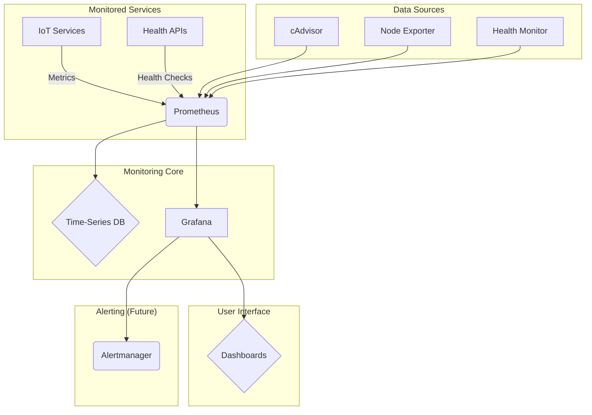

# Monitoring Stack Overview

## Overview

The MQTT Architecture POC includes a comprehensive monitoring stack designed to provide visibility into system health, performance, and data flow across all components.

## Monitoring Architecture



## Core Monitoring Components

### 1. **Prometheus** - Metrics Collection
- **Purpose**: Time-series metrics collection and storage
- **Port**: 9090
- **Configuration**: `/monitoring/prometheus/prometheus.yml`
- **Retention**: 200 hours

### 2. **Grafana** - Visualization
- **Purpose**: Dashboards and data visualization
- **Port**: 3000
- **Credentials**: admin/admin
- **Dashboards**: IoT Architecture Dashboard

### 3. **cAdvisor** - Container Metrics
- **Purpose**: Docker container resource monitoring
- **Port**: 8080
- **Metrics**: CPU, memory, network, disk usage per container

### 4. **Node Exporter** - Host Metrics
- **Purpose**: Host system metrics collection
- **Port**: 9100
- **Metrics**: CPU, memory, disk, network at host level

### 5. **Health Monitor** - Service Health
- **Purpose**: Custom health checks and service status
- **Port**: 8000
- **Features**: Docker API integration, service status endpoints

## Monitoring Stack Deployment

### Docker Compose Configuration
```yaml
# monitoring/docker-compose.monitoring.yml
services:
  prometheus:
    image: prom/prometheus:latest
    ports: ["9090:9090"]
    volumes:
      - ./prometheus/prometheus.yml:/etc/prometheus/prometheus.yml
      - prometheus_data:/prometheus
    
  grafana:
    image: grafana/grafana:latest
    ports: ["3000:3000"]
    environment:
      - GF_SECURITY_ADMIN_PASSWORD=admin
    volumes:
      - grafana_data:/var/lib/grafana
      - ./grafana/provisioning:/etc/grafana/provisioning
      
  cadvisor:
    image: gcr.io/cadvisor/cadvisor:latest
    ports: ["8080:8080"]
    volumes:
      - /:/rootfs:ro
      - /var/run:/var/run:ro
      - /sys:/sys:ro
      - /var/lib/docker/:/var/lib/docker:ro
      
  node-exporter:
    image: prom/node-exporter:latest
    ports: ["9100:9100"]
    
  health-monitor:
    build: ./health_monitor
    ports: ["8000:8000"]
    volumes:
      - /var/run/docker.sock:/var/run/docker.sock:ro
```

### Quick Start Commands

To start the complete system with monitoring run:

```bash
docker-compose up -d && docker-compose -f monitoring/docker-compose.monitoring.yml up -d
```

To start only monitoring stack run:

```bash
docker-compose -f monitoring/docker-compose.monitoring.yml up -d
```
To check system status run:

```bash
docker-compose ps && docker-compose -f monitoring/docker-compose.monitoring.yml ps
```

To monitor health run:

```bash
curl http://localhost:8000/health
```

## Access Points

### Web Interfaces
- **Grafana Dashboards**: http://localhost:3000 (admin/admin)
- **Prometheus Metrics**: http://localhost:9090
- **Health Monitor API**: http://localhost:8000
- **Container Metrics**: http://localhost:8080
- **Host Metrics**: http://localhost:9100

### Command Line Access
```bash
# Health check all services
curl http://localhost:8000/health

# Service-specific health
curl http://localhost:8000/health/mosquitto
curl http://localhost:8000/health/kafka

# Prometheus query
curl 'http://localhost:9090/api/v1/query?query=up'
```

## Key Metrics Monitored

### System-Level Metrics
- **CPU Usage**: Per container and host
- **Memory Usage**: RAM and swap utilization
- **Disk Usage**: Storage consumption and I/O
- **Network Traffic**: Bytes in/out, connections

### Application-Level Metrics
- **Service Health**: Up/down status for all components
- **Container Health**: Docker container states
- **Process Metrics**: Service-specific process monitoring

### IoT Pipeline Metrics
- **Message Throughput**: Messages per second through pipeline
- **Processing Latency**: End-to-end message processing times
- **Error Rates**: Failed messages, connection errors
- **Database Performance**: Query times, connection pool status

## Grafana Dashboards

### IoT Architecture Dashboard
**File**: `/monitoring/grafana/dashboards/iot-architecture-dashboard.json`

**Panels Include**:
1. **System Overview**
   - Service health status
   - Container resource usage
   - System uptime

2. **Resource Monitoring**
   - CPU usage per service
   - Memory consumption
   - Disk I/O performance

3. **Network Monitoring**
   - Network traffic by container
   - Connection status
   - Throughput metrics

4. **Service-Specific Metrics**
   - MQTT message rates
   - Kafka topic lag
   - Database connection pools

### Dashboard Features
- **Real-time Updates**: 5-second refresh intervals
- **Time Range Selection**: Configurable time windows
- **Alerting Capabilities**: Visual thresholds and alerts
- **Drill-down Navigation**: Click-through to detailed views

## Health Check Endpoints

### Health Monitor API
**Service**: `health-monitor`
**Implementation**: FastAPI with Docker integration

#### Available Endpoints

##### System Health
```bash
GET /health
# Returns overall system health status
```

##### Individual Service Health
```bash
GET /health/{service_name}
# Returns specific service health
# Services: mosquitto, kafka, postgres, timescaledb, zookeeper
```

##### Container Status
```bash
GET /containers
# Returns status of all containers
```

##### Metrics Export
```bash
GET /metrics
# Prometheus-compatible metrics endpoint
```

### Health Check Implementation
```python
# Example health check logic
async def check_service_health(service_name: str):
    try:
        container = docker_client.containers.get(service_name)
        if container.status == 'running':
            # Additional service-specific checks
            return {"status": "healthy", "uptime": container.attrs['State']['StartedAt']}
        else:
            return {"status": "unhealthy", "state": container.status}
    except Exception as e:
        return {"status": "error", "message": str(e)}
```

## Prometheus Configuration

### Scrape Targets
```yaml
# prometheus/prometheus.yml
scrape_configs:
  - job_name: 'prometheus'
    static_configs:
      - targets: ['localhost:9090']
      
  - job_name: 'node-exporter'
    static_configs:
      - targets: ['node-exporter:9100']
      
  - job_name: 'cadvisor'
    static_configs:
      - targets: ['cadvisor:8080']
      
  - job_name: 'health-monitor'
    static_configs:
      - targets: ['health-monitor:8000']
    metrics_path: '/metrics'
```

### Retention and Storage
- **Retention Time**: 200 hours (8+ days)
- **Storage Path**: `/prometheus` (persistent volume)
- **Scrape Interval**: 15 seconds
- **Evaluation Interval**: 15 seconds

## Alerting and Notifications

### Future Alerting Rules
```yaml
# Example alerting rules (future implementation)
groups:
  - name: iot_alerts
    rules:
      - alert: ServiceDown
        expr: up{job=~"health-monitor|cadvisor|node-exporter"} == 0
        for: 1m
        labels:
          severity: critical
        annotations:
          summary: "Service {{ $labels.job }} is down"
          
      - alert: HighCPUUsage
        expr: rate(container_cpu_usage_seconds_total[5m]) * 100 > 80
        for: 5m
        labels:
          severity: warning
        annotations:
          summary: "High CPU usage detected"
```

## Operational Procedures

### Daily Monitoring Tasks

To check overall system health run:

```bash
curl http://localhost:8000/health
```

To view recent logs for any errors run:

```bash
docker-compose logs -f | grep ERROR
```

To check resource usage run:

```bash
curl http://localhost:8080/containers/
```

### Weekly Monitoring Tasks

To review Grafana dashboards for trends access: http://localhost:3000

To check disk usage growth run:

```bash
df -h
```

To review retention policies run:

```bash
docker system df
```

### Troubleshooting Commands

To check service-specific health run:

```bash
curl http://localhost:8000/health/kafka
curl http://localhost:8000/health/mosquitto
```

To check container resource usage run:

```bash
docker stats
```

To check Prometheus targets run:

```bash
curl http://localhost:9090/api/v1/targets
```

## Log Aggregation

### Centralized Logging

To view all service logs run:

```bash
docker-compose logs -f
```

To view service-specific logs run:

```bash
docker-compose logs -f mqtt-kafka-connector
docker-compose logs -f data-processor
docker-compose logs -f kafka-timescale-sink
docker-compose logs -f f2-simulator
```

### Log Retention
- **Location**: Docker container logs
- **Retention**: Managed by Docker log rotation
- **Format**: Structured JSON logs with timestamps

## Future Enhancements

1. **Alerting Integration**: Slack/email notifications
2. **Custom Metrics**: Application-specific metrics export
3. **Log Aggregation**: ELK stack integration
4. **Distributed Tracing**: Jaeger integration
5. **SLA Monitoring**: Service level agreement tracking
6. **Capacity Planning**: Predictive scaling metrics
7. **Security Monitoring**: Audit logs and security events
